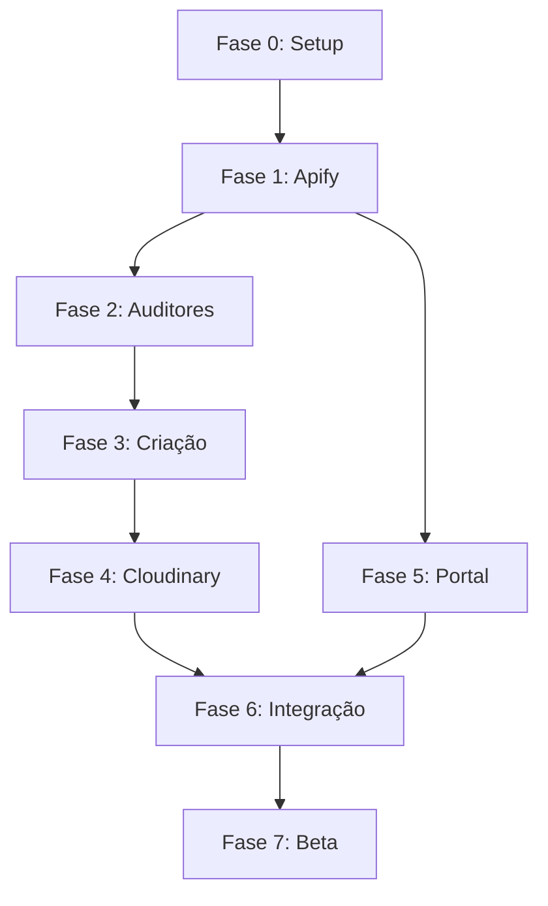

# 🚀 Roadmap de Desenvolvimento: Post Express
## Orquestrado pelos Agentes AIOS

**Projeto**: Post Express - Sistema de Criação de Conteúdo Automatizado
**Metodologia**: AIOS-Driven Development
**Data**: 2026-02-16
**Analista**: Atlas (@analyst)

---

## 🎯 VISÃO GERAL DA ORQUESTRAÇÃO

### Agentes AIOS Envolvidos

| Agente | Papel | Quando Ativar |
|--------|-------|---------------|
| **@pm (Morgan)** | Product Manager | Épicos, PRDs, decisões estratégicas |
| **@architect (Aria)** | Arquiteto | Stack técnica, integrações, schemas |
| **@dev** | Developer | Implementação de código |
| **@qa** | Quality Assurance | Testes, validação, quality gates |
| **@devops (Gage)** | DevOps | Infra, deploy, MCP servers, Docker |
| **@analyst (Atlas)** | Analista | Pesquisa, viabilidade, competição |
| **@po (Pax)** | Product Owner | Stories, backlog, priorização |
| **@sm (River)** | Scrum Master | Sprint planning, stories detalhadas |
| **@ux-design-expert** | UX Designer | Wireframes, user flows, UI |
| **@data-engineer** | Data Engineer | ETL, pipelines, Apify → Supabase |

---

## 📋 FASES DO PROJETO

### **FASE 0: FUNDAÇÃO & SETUP** (Semana 1)
**Objetivo**: Configurar ambiente e estrutura base

#### 0.1 - Setup AIOS-Core
**Responsável**: @devops (Gage)
**Duração**: 1 dia

```bash
@devops *setup-mcp-docker  # Configurar Docker MCP
@devops *add-mcp apify     # Adicionar Apify MCP
```

**Entregáveis**:
- [ ] AIOS-Core instalado
- [ ] Docker MCP configurado
- [ ] Apify MCP funcionando
- [ ] Ambiente de desenvolvimento pronto

**Critérios de Aceitação**:
- `npx aios-core init post-express` executa sem erros
- Docker MCP lista Apify como disponível

---

#### 0.2 - Estrutura de Pastas
**Responsável**: @architect (Aria)
**Duração**: 2 horas

**Atividade**:
```bash
@architect
"Crie a estrutura de pastas do Post Express seguindo padrão AIOS-Core:
- squads/ (auditores, criacao)
- docs/ (epics, stories, architecture)
- src/ (código fonte)
- scripts/ (automações)
- .aios/ (configurações)"
```

**Entregáveis**:
- [ ] Estrutura de pastas criada
- [ ] README.md de cada pasta
- [ ] .gitignore configurado

---

#### 0.3 - Schema do Banco de Dados
**Responsável**: @architect (Aria)
**Duração**: 4 horas

**Atividade**:
```bash
@architect
"Refine o schema Supabase do PRD:
1. Tabela clientes (adicionar campos faltantes)
2. Tabela conteudos (JSONB schema completo)
3. Tabela auditorias (nova)
4. Tabela scraping_logs (nova)
5. RLS policies
6. Foreign keys e índices"
```

**Entregáveis**:
- [ ] `docs/architecture/database-schema.md`
- [ ] SQL migrations em `src/db/migrations/`
- [ ] Supabase configurado (dev environment)

**Validação por @qa**:
- [ ] Schema reviewed
- [ ] Índices otimizados
- [ ] RLS policies testadas

---

### **FASE 1: INTEGRAÇÃO APIFY → SUPABASE** (Semana 2)
**Objetivo**: Coleta de dados funcionando

#### 1.1 - Pesquisa de Actors Apify
**Responsável**: @analyst (Atlas)
**Duração**: 4 horas

**Atividade**:
```bash
@analyst *perform-market-research
"Pesquisar e validar Actors do Apify:
- Instagram Profile Scraper (teste com conta real)
- TikTok Scraper (validar dados retornados)
- YouTube Scraper (testar transcrições)
- Documentar schema de output de cada Actor
- Calcular custos por cliente/mês"
```

**Entregáveis**:
- [ ] `docs/integrations/apify-actors-research.md`
- [ ] Schema JSON de cada Actor
- [ ] Custos detalhados
- [ ] Limitações e rate limits

---

#### 1.2 - Pipeline ETL Apify → Supabase
**Responsável**: @data-engineer
**Duração**: 2 dias

**Atividade**:
```bash
@data-engineer
"Implementar pipeline de dados:
1. Wrapper para Apify MCP
2. Transformação de dados (Actor JSON → Supabase schema)
3. Ingestão no Supabase
4. Error handling e retry logic
5. Logging de scraping"
```

**Entregáveis**:
- [ ] `src/etl/apify-connector.js`
- [ ] `src/etl/data-transformer.js`
- [ ] `src/etl/supabase-loader.js`
- [ ] Testes unitários (coverage > 80%)

**Code Review por @architect**:
- [ ] Arquitetura aprovada
- [ ] Error handling robusto
- [ ] Performance otimizada

**QA por @qa**:
- [ ] Testes passando
- [ ] Edge cases cobertos
- [ ] Integração testada end-to-end

---

### **FASE 2: SQUAD AUDITORES** (Semana 3)
**Objetivo**: Auditoria automatizada de conteúdo

#### 2.1 - Mapear Marty Cagan
**Responsável**: MMOS-Squad (Mind Mapper)
**Duração**: 4 horas

**Atividade**:
```bash
# Usar agente mind-mapper do mmos-squad
@mind-mapper
"Mapear Marty Cagan:
- Ler INSPIRED (principais capítulos)
- Extrair frameworks de métricas
- Criar system prompt v1.0
- Validar com exemplos"
```

**Entregáveis**:
- [ ] `squad-auditores/minds/marty_cagan/system_prompts/v1.0.md`
- [ ] `squad-auditores/minds/marty_cagan/artifacts/metrics-frameworks.md`
- [ ] Testes de fidelidade

---

#### 2.2 - Orquestrar Squad Auditores
**Responsável**: @dev
**Duração**: 3 dias

**Atividade**:
```bash
@dev
"Implementar orquestração do Squad Auditores:
1. Workflow runner (7 fases do pipeline)
2. Integração com 5 mentes:
   - Daniel Kahneman (comportamento)
   - Eugene Schwartz (copy)
   - Alex Hormozi (ofertas)
   - Marty Cagan (métricas)
   - Paul Graham (anomalias)
3. Agregação de scores (pesos: 20%, 25%, 25%, 15%, 15%)
4. Geração de Score Card
5. Armazenamento no Supabase (tabela auditorias)"
```

**Entregáveis**:
- [ ] `src/squads/auditores/orchestrator.js`
- [ ] `src/squads/auditores/score-aggregator.js`
- [ ] `src/squads/auditores/score-card-generator.js`
- [ ] Testes de integração

**Code Review por @architect**:
- [ ] Padrão AIOS respeitado
- [ ] Modular e extensível

**QA por @qa**:
- [ ] Score Card gerado corretamente
- [ ] Pesos aplicados corretamente
- [ ] Output validado

---

### **FASE 3: SQUAD CRIAÇÃO** (Semana 4)
**Objetivo**: Geração de carrosséis automatizada

#### 3.1 - Expandir Alex Hormozi
**Responsável**: MMOS-Squad (Mind Mapper)
**Duração**: 5 horas

**Atividade**:
```bash
@mind-mapper
"Expandir mapeamento Alex Hormozi:
- Ler $100M Offers (completo)
- Extrair Value Equation
- Mapear frameworks de urgência/escassez
- Criar system prompt v2.0
- Validar com exemplos de vendas"
```

**Entregáveis**:
- [ ] System prompt v2.0
- [ ] Value Equation completa
- [ ] Templates de oferta

---

#### 3.2 - Construir/Validar Thiago Finch
**Responsável**: @analyst (Atlas) + MMOS-Squad
**Duração**: 6 horas

**Decisão A: Mapear Thiago Finch**
```bash
@analyst
"Pesquisar Thiago Finch:
- Buscar conteúdo público (vídeos, posts, cursos)
- Extrair padrões de linguagem BR
- Gatilhos mentais específicos BR
- Criar system prompt se houver material suficiente"
```

**OU Decisão B: Usar Pedro Valério**
```bash
@analyst
"Investigar Pedro Valério:
- Verificar se é especialista em marketing BR
- Comparar com Thiago Finch
- Decidir qual usar"
```

**Entregáveis**:
- [ ] Decisão: Finch vs Valério vs Construir do zero
- [ ] System prompt da mente escolhida
- [ ] Validação de localização BR

---

#### 3.3 - Orquestrar Squad Criação
**Responsável**: @dev
**Duração**: 3 dias

**Atividade**:
```bash
@dev
"Implementar orquestração do Squad Criação:
1. Workflow runner (7 fases: BRIEFING → ESTRATÉGIA → COPY → OTIMIZAÇÃO → LOCALIZAÇÃO → VISUAL → REVIEW)
2. Integração com 5 mentes (Eugene, Seth, Alex, Thiago/Pedro, Adriano)
3. Aplicação de fórmulas de carrossel (carousel-formulas.json)
4. Uso de hooks database
5. Output em formato estruturado (JSON + Markdown)"
```

**Entregáveis**:
- [ ] `src/squads/criacao/orchestrator.js`
- [ ] `src/squads/criacao/formula-selector.js`
- [ ] `src/squads/criacao/output-formatter.js`
- [ ] Testes end-to-end (gerar 10 carrosséis de teste)

**QA por @qa**:
- [ ] Qualidade do copy validada (manual review)
- [ ] Fórmulas aplicadas corretamente
- [ ] Tempo de geração < 15 min

---

### **FASE 4: GERAÇÃO VISUAL (CLOUDINARY)** (Semana 5)
**Objetivo**: Imagens automáticas dos carrosséis

#### 4.1 - Template HTML/CSS Tweet-Style
**Responsável**: @ux-design-expert
**Duração**: 2 dias

**Atividade**:
```bash
@ux-design-expert
"Criar template HTML/CSS tweet-style:
1. Baseado no spec do PRD (fundo branco, foto circular, etc.)
2. Responsivo (mobile-first)
3. Variações: só texto / texto + imagem
4. Acessibilidade (contraste, WCAG AA)
5. Customizável (cores, fontes via props)"
```

**Entregáveis**:
- [ ] `src/templates/tweet-style/base.html`
- [ ] `src/templates/tweet-style/styles.css`
- [ ] Props interface (TypeScript)
- [ ] Preview local (página HTML de teste)

**Review por @architect**:
- [ ] Performance (lightweight)
- [ ] Renderiza corretamente

---

#### 4.2 - Integração Cloudinary
**Responsável**: @dev
**Duração**: 2 dias

**Atividade**:
```bash
@dev
"Implementar geração de imagens via Cloudinary:
1. Integração com Cloudinary API
2. Upload de template HTML
3. Renderização (HTML → PNG 1080x1080)
4. Otimização de imagens
5. Armazenamento de URLs no Supabase"
```

**Entregáveis**:
- [ ] `src/visual/cloudinary-renderer.js`
- [ ] `src/visual/image-optimizer.js`
- [ ] Testes de geração (10 slides)

**QA por @qa**:
- [ ] Imagens geradas corretamente
- [ ] Performance aceitável (< 5s por slide)
- [ ] Qualidade visual alta

---

### **FASE 5: PORTAL DO CLIENTE** (Semanas 6-7)
**Objetivo**: Interface web para aprovação

#### 5.1 - Wireframes & User Flows
**Responsável**: @ux-design-expert
**Duração**: 1 dia

**Atividade**:
```bash
@ux-design-expert
"Criar wireframes do portal:
1. Tela de login (magic link)
2. Dashboard do cliente (lista de carrosséis)
3. Visualização de carrossel (galeria de slides)
4. Fluxo de aprovação (aprovar/rejeitar/solicitar ajustes)
5. Histórico de conteúdos
6. Mobile-responsive"
```

**Entregáveis**:
- [ ] Wireframes (Figma/Excalidraw)
- [ ] User flows documentados
- [ ] Design system básico (cores, tipografia)

**Review por @pm**:
- [ ] UX aprovada
- [ ] Flows fazem sentido

---

#### 5.2 - Definir Stack Frontend
**Responsável**: @architect (Aria)
**Duração**: 2 horas

**Atividade**:
```bash
@architect
"Definir stack técnica do portal:
- Framework: Next.js 14 (App Router) ou Remix?
- UI: Shadcn/ui + Tailwind ou outra?
- Auth: Supabase Auth (magic link)
- Deploy: Vercel, Railway ou Cloudflare?
- Justificar decisões"
```

**Entregáveis**:
- [ ] `docs/architecture/frontend-stack.md`
- [ ] ADR (Architecture Decision Record)

---

#### 5.3 - Implementar Frontend
**Responsável**: @dev
**Duração**: 5 dias

**Atividade**:
```bash
@dev
"Desenvolver portal do cliente:
1. Setup Next.js + Supabase Auth
2. Tela de login (magic link)
3. Dashboard (listar carrosséis)
4. Visualização de carrossel (galeria)
5. Sistema de status (pendente/aprovado/ajustes)
6. Comentários/feedback
7. Integração com backend"
```

**Entregáveis**:
- [ ] `portal/` (código Next.js)
- [ ] Componentes reutilizáveis
- [ ] Testes E2E (Playwright)
- [ ] Deploy em staging

**QA por @qa**:
- [ ] Funcionalidades testadas
- [ ] Mobile-responsive validado
- [ ] Auth funcionando

---

### **FASE 6: INTEGRAÇÃO & AUTOMAÇÃO** (Semana 8)
**Objetivo**: Fluxo completo end-to-end

#### 6.1 - Fluxo Completo
**Responsável**: @dev
**Duração**: 3 dias

**Atividade**:
```bash
@dev
"Integrar todos os componentes:
1. Trigger de scraping (semanal/manual)
2. Apify → Supabase → Squad Auditores → Score Card
3. Squad Criação → Carrossel → Cloudinary → Imagens
4. Notificação ao cliente (email: novo conteúdo)
5. Portal: cliente aprova/rejeita
6. Feedback loop (ajustes)"
```

**Entregáveis**:
- [ ] `src/workflows/end-to-end.js`
- [ ] Scheduler (cron jobs)
- [ ] Sistema de notificações (email)

**QA por @qa**:
- [ ] Fluxo completo testado (3 clientes fake)
- [ ] Performance aceitável
- [ ] Sem erros críticos

---

#### 6.2 - Deploy & Infra
**Responsável**: @devops (Gage)
**Duração**: 2 dias

**Atividade**:
```bash
@devops
"Deploy em produção:
1. Backend: Railway ou Render?
2. Frontend: Vercel
3. DB: Supabase (production tier)
4. Cloudinary: Production tier
5. Apify: Configurar créditos
6. CI/CD: GitHub Actions
7. Monitoring: Sentry + logging"
```

**Entregáveis**:
- [ ] Produção deployada
- [ ] CI/CD configurado
- [ ] Monitoring ativo
- [ ] Documentação de deploy

---

### **FASE 7: VALIDAÇÃO & BETA** (Semana 9-10)
**Objetivo**: Testar com clientes reais

#### 7.1 - Beta com 5 Clientes
**Responsável**: @pm (Morgan)
**Duração**: 2 semanas

**Atividade**:
```bash
@pm
"Coordenar beta:
1. Selecionar 5 clientes (diversos nichos)
2. Onboarding manual
3. Gerar 10 carrosséis para cada
4. Coletar feedback estruturado
5. Medir métricas:
   - Taxa de aprovação (meta: >80%)
   - Tempo de geração (meta: <15min)
   - Satisfação (NPS meta: >8)
6. Iterar baseado em feedback"
```

**Entregáveis**:
- [ ] 5 clientes onboarded
- [ ] 50 carrosséis gerados
- [ ] Relatório de feedback
- [ ] Lista de melhorias prioritárias

---

#### 7.2 - Iteração & Refinamento
**Responsável**: @dev + @pm
**Duração**: 1 semana

**Atividade**:
- Corrigir bugs críticos
- Ajustar prompts das mentes (se necessário)
- Otimizar performance
- Melhorar UX baseado em feedback

---

## 📊 CRONOGRAMA GERAL

| Fase | Semanas | Agente Principal | Status |
|------|---------|------------------|--------|
| **0. Fundação** | Semana 1 | @devops + @architect | ⏳ Pendente |
| **1. Apify → Supabase** | Semana 2 | @data-engineer + @analyst | ⏳ Pendente |
| **2. Squad Auditores** | Semana 3 | @dev + Mind Mapper | ⏳ Pendente |
| **3. Squad Criação** | Semana 4 | @dev + Mind Mapper | ⏳ Pendente |
| **4. Cloudinary** | Semana 5 | @dev + @ux-design | ⏳ Pendente |
| **5. Portal Cliente** | Semanas 6-7 | @dev + @ux-design | ⏳ Pendente |
| **6. Integração** | Semana 8 | @dev + @devops | ⏳ Pendente |
| **7. Beta** | Semanas 9-10 | @pm + @qa | ⏳ Pendente |

**TOTAL**: 10 semanas (2.5 meses)

---

## 🎯 DEPENDÊNCIAS CRÍTICAS



---

## 🚦 GATES DE QUALIDADE

### **Gate 1: Após Fase 2** (Squad Auditores)
**Responsável**: @qa

**Critérios**:
- [ ] Score Card gerado corretamente
- [ ] 5 mentes funcionando (fidelidade >70%)
- [ ] Benchmark: 10 contas auditadas sem erros

**Go/No-Go**: Se falhar, iterar antes de prosseguir

---

### **Gate 2: Após Fase 3** (Squad Criação)
**Responsável**: @qa + @pm

**Critérios**:
- [ ] 20 carrosséis gerados
- [ ] Qualidade de copy aprovada (review manual)
- [ ] Tempo médio < 15 min
- [ ] Taxa de satisfação interna > 80%

**Go/No-Go**: Se falhar, refinar prompts

---

### **Gate 3: Após Fase 6** (Integração)
**Responsável**: @qa

**Critérios**:
- [ ] Fluxo end-to-end funciona
- [ ] 0 erros críticos
- [ ] Performance aceitável
- [ ] 3 clientes fake testados com sucesso

**Go/No-Go**: Se falhar, debug antes de beta

---

## 📋 PRÓXIMAS AÇÕES IMEDIATAS

### **Ação 1: Kickoff com @pm**
```bash
@pm *create-epic
"Criar épicos para Post Express baseado neste roadmap"
```

**Output esperado**:
- Epic 1: Fundação & Setup
- Epic 2: Pipeline de Dados
- Epic 3: Squads de IA
- Epic 4: Geração Visual
- Epic 5: Portal do Cliente
- Epic 6: Integração & Deploy
- Epic 7: Beta & Validação

---

### **Ação 2: Definir Sprints com @sm**
```bash
@sm
"Quebrar épicos em stories de 2-3 dias cada"
```

---

### **Ação 3: Setup Inicial com @devops**
```bash
@devops *setup-mcp-docker
@devops *add-mcp apify
```

---

## 💬 COORDENAÇÃO ENTRE AGENTES

### **Handoffs Críticos**

#### @analyst → @pm
- **Quando**: Após pesquisa de Actors Apify
- **O quê**: Documento com custos e viabilidade
- **Ação PM**: Decidir go/no-go na integração

#### @architect → @dev
- **Quando**: Após definição de schema/stack
- **O quê**: Specs técnicas completas
- **Ação Dev**: Implementar conforme specs

#### @dev → @qa
- **Quando**: Feature completa
- **O quê**: PR + testes
- **Ação QA**: Validar e aprovar/rejeitar

#### @qa → @pm
- **Quando**: Gate de qualidade
- **O quê**: Relatório de testes
- **Ação PM**: Decisão go/no-go para próxima fase

---

## 🎯 MÉTRICAS DE SUCESSO DO PROJETO

| Métrica | Meta | Como Medir |
|---------|------|------------|
| **Tempo de Setup** | < 1 semana | Gate Fase 0 |
| **Score Card Accuracy** | > 90% | Gate Fase 2 |
| **Copy Quality** | > 80% aprovação | Gate Fase 3 |
| **Tempo Geração** | < 15 min | Logs do sistema |
| **Beta Satisfaction** | NPS > 8 | Survey clientes beta |
| **Taxa Aprovação** | > 80% | Portal analytics |

---

**Compilado por**: Atlas (@analyst)
**Aprovação necessária**: @pm (Morgan)
**Data**: 2026-02-16
**Versão**: 1.0
