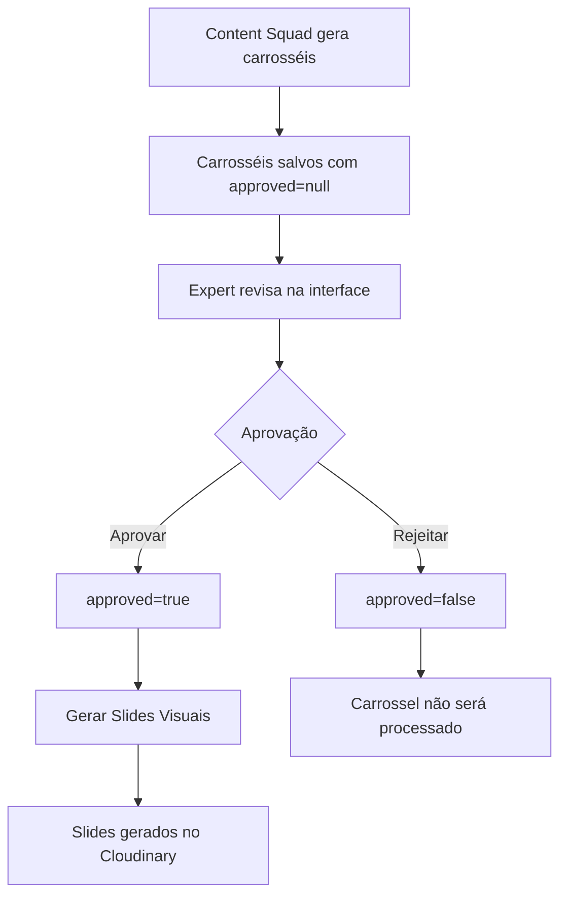

# Sistema de Aprovação de Carrosséis

## 📋 Visão Geral

O sistema de aprovação permite que o expert revise e aprove carrosséis antes de gerar os slides visuais no Cloudinary. Isso garante controle total sobre qual conteúdo será produzido visualmente.

## 🔄 Fluxo Completo



## 🗄️ Estrutura de Dados

### Banco de Dados

**Tabela:** `content_suggestions`

```sql
CREATE TABLE content_suggestions (
  id UUID PRIMARY KEY,
  audit_id UUID REFERENCES audits(id),
  profile_id UUID REFERENCES profiles(id),
  content_json JSONB NOT NULL,  -- Contém os carrosséis
  slides_json JSONB,             -- URLs dos slides gerados
  generated_at TIMESTAMP,
  created_at TIMESTAMP,
  updated_at TIMESTAMP
);
```

### Estrutura do JSON (content_json)

```json
{
  "carousels": [
    {
      "titulo": "Título do Carrossel",
      "tipo": "educacional",
      "objetivo": "Resolver problema X da auditoria",
      "baseado_em": "Insight Y dos auditores",
      "approved": true,  // ← Campo de aprovação
      "slides": [
        {
          "numero": 1,
          "tipo": "hook",
          "titulo": "Título do Slide",
          "corpo": "Texto do slide",
          "notas_design": "Sugestões visuais"
        }
      ],
      "caption": "Legenda do Instagram...",
      "hashtags": ["tag1", "tag2"],
      "cta": "Call to action específico"
    }
  ],
  "estrategia_geral": "Explicação da estratégia",
  "proximos_passos": ["Recomendação 1", "Recomendação 2"]
}
```

### Estados do Campo `approved`

| Valor | Significado | Visualmente |
|-------|-------------|-------------|
| `null` | Ainda não revisado | Sem badge |
| `true` | Aprovado pelo expert | Badge verde "✓ Aprovado" |
| `false` | Rejeitado pelo expert | Badge vermelho "✗ Não Aprovado" (opacidade reduzida) |

## 🛠️ APIs

### 1. Aprovar/Rejeitar Um Carrossel

**Endpoint:** `PUT /api/content/[id]/approve`

**Body:**
```json
{
  "carouselIndex": 0,
  "approved": true
}
```

**Resposta:**
```json
{
  "success": true,
  "carouselIndex": 0,
  "approved": true
}
```

### 2. Aprovar/Rejeitar Múltiplos Carrosséis

**Endpoint:** `POST /api/content/[id]/approve`

**Body:**
```json
{
  "approvals": [
    { "carouselIndex": 0, "approved": true },
    { "carouselIndex": 1, "approved": false },
    { "carouselIndex": 2, "approved": true }
  ]
}
```

**Resposta:**
```json
{
  "success": true,
  "processed": 3,
  "approved": 2
}
```

### 3. Gerar Slides Visuais

**Endpoint:** `POST /api/content/[id]/generate-slides`

**Comportamento:**
- Filtra apenas carrosséis com `approved: true`
- Retorna erro 400 se nenhum carrossel estiver aprovado
- Gera slides apenas dos aprovados
- Usa Puppeteer + Cloudinary para criar imagens

**Body:**
```json
{
  "carousels": [...],
  "profile": { "username": "...", "profile_pic_url": "..." }
}
```

**Resposta:**
```json
{
  "success": true,
  "carousels": [
    {
      "carouselIndex": 0,
      "carouselName": "carrossel-1",
      "title": "Título do Carrossel",
      "approved": true,
      "slides": [
        {
          "slideNumber": 1,
          "cloudinaryUrl": "https://res.cloudinary.com/...",
          "cloudinaryPublicId": "...",
          "width": 1080,
          "height": 1350,
          "size": 234567
        }
      ],
      "totalSlides": 8
    }
  ],
  "summary": {
    "totalCarousels": 1,
    "totalSlides": 8
  }
}
```

## 🎨 Interface do Usuário

### Elementos Visuais

1. **Badge de Status**
   - 🟢 Verde: "✓ Aprovado" (quando `approved: true`)
   - 🔴 Vermelho: "✗ Não Aprovado" (quando `approved: false`)
   - Sem badge quando `approved: null`

2. **Botões de Aprovação**
   - **Botão "Aprovar"**: Verde quando aprovado, outline quando não
   - **Botão "Rejeitar"**: Vermelho quando rejeitado, outline quando não
   - Ambos desabilitados durante o processo de aprovação

3. **Visual do Card**
   - Aprovado: Border verde, background verde claro
   - Rejeitado: Border vermelho, background vermelho claro, opacidade 60%
   - Pendente: Border padrão (primary)

4. **Botão de Gerar Slides**
   - Mostra contador: "Gerar Slides Visuais (2/3 aprovados)"
   - Desabilitado se `approvedCarouselsCount === 0`
   - Tooltip explicativo quando desabilitado

### Fluxo do Expert

1. **Gerar Sugestões**
   - Clicar em "Gerar Sugestões" (chama Content Squad via Claude API)
   - Aguardar geração dos 3 carrosséis

2. **Revisar Carrosséis**
   - Ler cada carrossel completo (slides, caption, hashtags, CTA)
   - Avaliar qualidade, alinhamento com estratégia, aplicabilidade

3. **Aprovar/Rejeitar**
   - Clicar em "Aprovar" para carrosséis bons
   - Clicar em "Rejeitar" para carrosséis que não funcionam
   - Visual muda instantaneamente

4. **Gerar Slides**
   - Botão só fica habilitado com pelo menos 1 aprovado
   - Clicar em "Gerar Slides Visuais (X/Y aprovados)"
   - Sistema gera apenas os aprovados no Cloudinary

5. **Visualizar Resultado**
   - Grid com preview dos slides gerados
   - Links para abrir em tamanho real no Cloudinary

## 🔍 Exemplos de Uso

### Cenário 1: Aprovar Todos

```bash
# Expert aprova os 3 carrosséis
PUT /api/content/abc123/approve
{ "carouselIndex": 0, "approved": true }

PUT /api/content/abc123/approve
{ "carouselIndex": 1, "approved": true }

PUT /api/content/abc123/approve
{ "carouselIndex": 2, "approved": true }

# Gera slides de todos (3)
POST /api/content/abc123/generate-slides
# Resultado: 3 carrosséis × ~8 slides cada = ~24 imagens
```

### Cenário 2: Aprovar Apenas 1

```bash
# Expert aprova apenas o carrossel 1
PUT /api/content/abc123/approve
{ "carouselIndex": 0, "approved": false }

PUT /api/content/abc123/approve
{ "carouselIndex": 1, "approved": true }

PUT /api/content/abc123/approve
{ "carouselIndex": 2, "approved": false }

# Gera slides apenas do carrossel 1
POST /api/content/abc123/generate-slides
# Resultado: 1 carrossel × ~8 slides = ~8 imagens
```

### Cenário 3: Rejeitar Todos (erro)

```bash
# Expert rejeita todos
POST /api/content/abc123/approve
{
  "approvals": [
    { "carouselIndex": 0, "approved": false },
    { "carouselIndex": 1, "approved": false },
    { "carouselIndex": 2, "approved": false }
  ]
}

# Tenta gerar slides (falha)
POST /api/content/abc123/generate-slides
# Erro 400: "Nenhum carrossel aprovado. Aprove pelo menos um carrossel antes de gerar slides."
```

## ✅ Validações

### Backend (API)

1. **Validação de Entrada**
   - `carouselIndex` deve ser número
   - `approved` deve ser boolean
   - Índice deve existir no array de carrosséis

2. **Validação de Estado**
   - Content suggestion deve existir
   - Carrossel no índice especificado deve existir

3. **Validação de Geração**
   - Pelo menos 1 carrossel com `approved: true`
   - Retorna erro 400 se nenhum aprovado

### Frontend (UI)

1. **Botões Desabilitados**
   - "Aprovar" desabilitado se já aprovado
   - "Rejeitar" desabilitado se já rejeitado
   - Ambos desabilitados durante processamento

2. **Botão de Gerar Slides**
   - Desabilitado se `approvedCarouselsCount === 0`
   - Mostra contador de aprovados
   - Tooltip explicativo quando desabilitado

3. **Feedback Visual**
   - Loading spinner durante aprovação
   - Badge de status atualizado instantaneamente
   - Visual do card muda conforme status

## 🚀 Benefícios

1. **Controle Total**: Expert decide qual conteúdo gerar visualmente
2. **Economia**: Não gasta processamento/Cloudinary com conteúdo rejeitado
3. **Qualidade**: Garante que apenas conteúdo de alta qualidade vira imagem
4. **Flexibilidade**: Pode aprovar 1, 2 ou todos os carrosséis
5. **Transparência**: Visual claro do que está aprovado/rejeitado
6. **UX Simples**: Apenas 2 botões (Aprovar/Rejeitar) por carrossel

## 📝 Notas de Implementação

### Arquivos Modificados

```
app/api/content/[id]/approve/route.ts              (NOVO)
app/api/content/[id]/generate-slides/route.ts      (MODIFICADO)
app/dashboard/audits/[id]/create-content/page.tsx  (MODIFICADO)
supabase/migrations/add_carousel_approval_docs.sql (NOVO)
```

### Compatibilidade

- **Carrosséis Antigos**: `approved: null` → tratados como "pendente"
- **Geração Antiga**: Se todos `approved: null`, falha com erro explicativo
- **Migração**: Não requer migration de dados, apenas adiciona campo

### Próximos Passos

1. ✅ API de aprovação implementada
2. ✅ Filtro na geração de slides implementado
3. ✅ Interface com botões e badges implementada
4. ⏳ Testes E2E do fluxo completo
5. ⏳ Analytics: quantos carrosséis são aprovados em média?

---

**Versão:** 1.0.0
**Data:** 2026-02-17
**Autor:** Claude Sonnet 4.5
