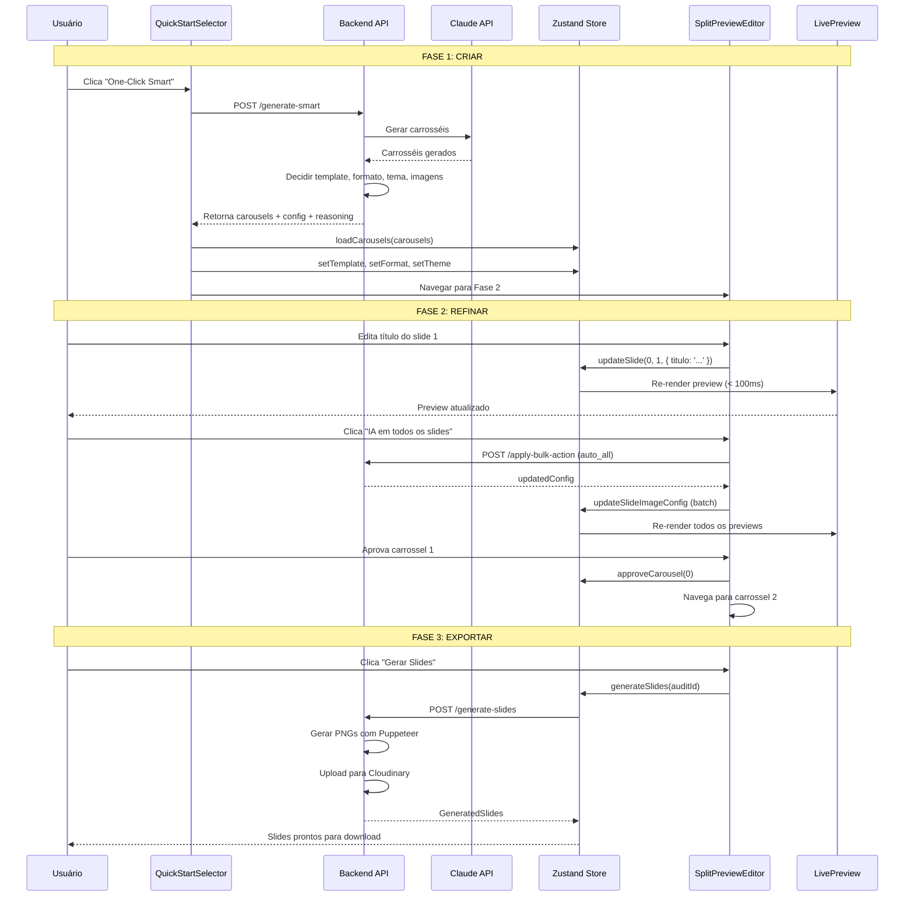

# 🏗️ Arquitetura do Content Creation Flow Optimization

> **Documento de Arquitetura Técnica**
> **Autor:** Architect Agent
> **Data:** 2026-02-23
> **Status:** Proposta para Aprovação
> **Baseado em:** `docs/ux/content-creation-flow-optimization.md`

---

## 📑 Índice

1. [Visão Geral](#visão-geral)
2. [Decisões de Arquitetura (ADRs)](#decisões-de-arquitetura-adrs)
3. [Estrutura de Componentes](#estrutura-de-componentes)
4. [Estado Global (Zustand)](#estado-global-zustand)
5. [APIs & Contratos](#apis--contratos)
6. [Tipos TypeScript](#tipos-typescript)
7. [Fluxo de Dados](#fluxo-de-dados)
8. [Estratégias de Rendering](#estratégias-de-rendering)
9. [Performance & Otimizações](#performance--otimizações)
10. [Segurança](#segurança)
11. [Plano de Implementação](#plano-de-implementação)

---

## 🎯 Visão Geral

### Contexto

O fluxo atual de criação de carrosséis no Croko Lab está fragmentado em 2 páginas com 50+ interações, resultando em:
- **Tempo médio:** 15-20 minutos
- **Taxa de conclusão:** ~60%
- **Taxa de retrabalho:** ~40%

### Objetivo

Redesenhar o fluxo para reduzir tempo, fricção e retrabalho através de:
- **Progressive Disclosure** (3 modos de início: Smart, Template, Advanced)
- **Live Preview** (visualização em tempo real)
- **Bulk Actions** (ações em massa para slides)

### Metas de Performance

| Métrica | Atual | Meta | Melhoria |
|---------|-------|------|----------|
| Tempo médio | 15-20 min | 8-10 min | **47% mais rápido** |
| Cliques | 50+ | 15-20 | **60% menos** |
| Taxa de conclusão | 60% | 85% | **+42%** |
| Taxa de retrabalho | 40% | 15% | **62% menos** |

---

## 📐 Decisões de Arquitetura (ADRs)

### ADR-001: Zustand para Estado Global

**Decisão:** Usar Zustand ao invés de Context API ou Redux.

**Razões:**
- ✅ Menos boilerplate que Redux
- ✅ Melhor performance que Context API (não re-renderiza todo o componente)
- ✅ TypeScript de primeira classe
- ✅ DevTools integrado
- ✅ Simples de integrar com Next.js 15 App Router

**Alternativas Consideradas:**
- ❌ Redux Toolkit: muito boilerplate para o caso de uso
- ❌ Context API: re-renders excessivos em lista de carrosséis
- ❌ Jotai/Recoil: menos maduro, menor comunidade

**Implementação:**
```typescript
// store/content-creation-store.ts
import { create } from 'zustand'
import { devtools, persist } from 'zustand/middleware'
```

---

### ADR-002: Canvas HTML5 para Preview (não Remotion Player)

**Decisão:** Usar Canvas HTML5 + CSS ao invés de Remotion Player para preview.

**Razões:**
- ✅ Preview não precisa ser 100% pixel-perfect do PNG final
- ✅ Canvas é muito mais rápido (<50ms render vs 500ms+ do Remotion)
- ✅ Menos dependências (Remotion é 10MB+)
- ✅ Preview em tempo real viável com Canvas
- ✅ Podemos usar Puppeteer/Remotion apenas na geração final

**Alternativas Consideradas:**
- ❌ Remotion Player: muito pesado para preview interativo
- ❌ SVG: difícil aplicar estilos de template dinâmicos
- ❌ Iframe + HTML: problemas de sandbox e segurança

**Implementação:**
```typescript
// components/molecules/live-slide-preview.tsx
// Usa OffscreenCanvas quando disponível
const canvas = new OffscreenCanvas(1080, 1350)
```

---

### ADR-003: Server-Side Image Processing

**Decisão:** Processar imagens (fal.ai, Cloudinary) no servidor, não no cliente.

**Razões:**
- ✅ API keys não expostas no browser
- ✅ CORS simplificado
- ✅ Rate limiting centralizado
- ✅ Cache em servidor (Cloudinary CDN)

**Implementação:**
```typescript
// app/api/audits/[id]/generate-smart/route.ts
// Backend chama fal.ai e retorna URL do Cloudinary
```

---

### ADR-004: Incremental Static Regeneration (ISR) para Templates

**Decisão:** Usar ISR para cachear configurações de templates.

**Razões:**
- ✅ Templates não mudam frequentemente
- ✅ Reduz latência de carregamento
- ✅ Escala melhor que SSR puro

**Implementação:**
```typescript
// app/api/templates/route.ts
export const revalidate = 3600 // 1 hora
```

---

### ADR-005: Versionamento de APIs com Query Param

**Decisão:** Usar query param `?v=2` ao invés de `/v2/` no path.

**Razões:**
- ✅ Mais simples de manter (um route.ts)
- ✅ Gradual rollout (feature flag)
- ✅ Backward compatible

**Implementação:**
```typescript
// app/api/audits/[id]/content/route.ts
const version = searchParams.get('v') || '1'
if (version === '2') { ... }
```

---

## 🧩 Estrutura de Componentes

### Hierarquia (Atomic Design)

```
app/dashboard/audits/[id]/create-content/page.tsx
│
├── templates/DashboardLayout (já existe)
│   └── organisms/Sidebar (já existe)
│
└── organisms/ContentCreationWizard (novo)
    │
    ├── molecules/ProgressStepper (novo)
    │   └── atoms/Badge (já existe)
    │
    ├── FASE 1: CRIAR
    │   └── organisms/QuickStartSelector (novo)
    │       ├── molecules/QuickStartCard (novo)
    │       │   ├── atoms/Card (já existe)
    │       │   ├── atoms/Button (já existe)
    │       │   └── lucide-react icons
    │       └── organisms/TemplateGallery (novo)
    │           └── molecules/TemplateCard (novo)
    │
    ├── FASE 2: REFINAR
    │   └── organisms/SplitPreviewEditor (novo)
    │       ├── molecules/CarouselNavigator (novo)
    │       │   ├── atoms/Button (já existe)
    │       │   └── atoms/Progress (já existe)
    │       │
    │       ├── molecules/ContentPanel (novo)
    │       │   ├── atoms/Accordion (novo - shadcn/ui)
    │       │   ├── molecules/SlideEditor (novo)
    │       │   │   ├── atoms/Input (já existe)
    │       │   │   ├── atoms/Textarea (novo)
    │       │   │   └── molecules/ImageConfigDropdown (novo)
    │       │   └── organisms/BulkActionsPanel (novo)
    │       │       └── atoms/Button (já existe)
    │       │
    │       └── molecules/PreviewPanel (novo)
    │           ├── molecules/LiveSlidePreview (novo)
    │           │   └── atoms/Canvas (nativo HTML5)
    │           └── molecules/PreviewControls (novo)
    │
    └── FASE 3: EXPORTAR
        └── organisms/ExportPanel (novo)
            ├── molecules/ExportOptions (novo)
            │   ├── atoms/Button (já existe)
            │   └── atoms/Badge (já existe)
            └── molecules/ExportProgress (novo)
                └── atoms/Progress (já existe)
```

---

## 📦 Componentes Detalhados

### 1. QuickStartSelector

**Caminho:** `components/organisms/quick-start-selector.tsx`

**Props:**
```typescript
interface QuickStartSelectorProps {
  auditId: string
  onModeSelect: (mode: QuickStartMode) => void
}

type QuickStartMode = 'smart' | 'template' | 'advanced'
```

**Responsabilidades:**
- Renderizar 3 cards de opção (Smart, Template, Advanced)
- Chamar API `/generate-smart` quando "Smart" selecionado
- Navegar para TemplateGallery quando "Template" selecionado
- Mostrar formulário avançado quando "Advanced" selecionado

**Estado Interno:**
- `loading: boolean` (carregando geração smart)
- `error: string | null`

**Dependências:**
- `atoms/Card`
- `atoms/Button`
- `molecules/QuickStartCard`

---

### 2. SplitPreviewEditor

**Caminho:** `components/organisms/split-preview-editor.tsx`

**Props:**
```typescript
interface SplitPreviewEditorProps {
  auditId: string
  carousels: Carousel[]
  currentIndex: number
  onNavigate: (direction: 'prev' | 'next') => void
  onApprove: (index: number) => void
  onReject: (index: number) => void
  onEdit: (index: number, changes: Partial<Carousel>) => void
}
```

**Responsabilidades:**
- Layout split 50/50 (Conteúdo | Preview)
- Sincronizar edições com preview em tempo real
- Gerenciar estado de aprovação por carrossel
- Keyboard shortcuts (← → para navegar)

**Estado Interno:**
- `expandedSlides: Set<number>` (slides expandidos no accordion)
- `previewLoading: boolean`

**Dependências:**
- `molecules/ContentPanel`
- `molecules/PreviewPanel`
- `molecules/CarouselNavigator`

---

### 3. BulkActionsPanel

**Caminho:** `components/organisms/bulk-actions-panel.tsx`

**Props:**
```typescript
interface BulkActionsPanelProps {
  carouselIndex: number
  totalSlides: number
  onApplyBulkAction: (action: BulkAction) => Promise<void>
}

type BulkAction =
  | { type: 'auto_all' }
  | { type: 'no_image_all' }
  | { type: 'custom_prompt_all'; prompt: string }
  | { type: 'upload_all'; imageUrl: string }
  | { type: 'copy_from'; sourceCarouselIndex: number }
```

**Responsabilidades:**
- Renderizar botões de ação em massa
- Confirmar ações destrutivas (modal)
- Aplicar ações via API `/apply-bulk-action`

**Estado Interno:**
- `confirmingAction: BulkAction | null`
- `applying: boolean`

**Dependências:**
- `atoms/Button`
- `atoms/Dialog` (shadcn/ui para confirmação)

---

### 4. LiveSlidePreview

**Caminho:** `components/molecules/live-slide-preview.tsx`

**Props:**
```typescript
interface LiveSlidePreviewProps {
  slide: CarouselSlide
  template: TemplateId
  format: LayoutFormat
  theme: 'light' | 'dark'
  imageConfig: SlideImageConfig
  width?: number
  height?: number
}
```

**Responsabilidades:**
- Renderizar preview do slide em Canvas HTML5
- Aplicar template visual (cores, fontes, layout)
- Atualizar em tempo real quando props mudam (<100ms)
- Suportar zoom e pan (opcional)

**Implementação:**
```typescript
useEffect(() => {
  const canvas = canvasRef.current
  if (!canvas) return

  const ctx = canvas.getContext('2d')
  if (!ctx) return

  // Limpar canvas
  ctx.clearRect(0, 0, canvas.width, canvas.height)

  // Aplicar background do tema
  ctx.fillStyle = theme === 'dark' ? '#1a1a1a' : '#ffffff'
  ctx.fillRect(0, 0, canvas.width, canvas.height)

  // Renderizar imagem (se houver)
  if (imageConfig.mode !== 'no_image' && imageUrl) {
    const img = new Image()
    img.src = imageUrl
    img.onload = () => {
      ctx.drawImage(img, 0, 0, canvas.width, canvas.height * 0.5)
    }
  }

  // Renderizar texto
  applyTemplate(ctx, slide, template, format)

}, [slide, template, format, theme, imageConfig])
```

**Dependências:**
- `lib/slide-templates/*` (funções de rendering de templates)

---

### 5. ProgressStepper

**Caminho:** `components/molecules/progress-stepper.tsx`

**Props:**
```typescript
interface ProgressStepperProps {
  currentStep: 1 | 2 | 3
  steps: Array<{
    id: number
    title: string
    status: 'pending' | 'current' | 'completed'
  }>
}
```

**Responsabilidades:**
- Renderizar breadcrumb no topo da página
- Indicar fase atual com cores e ícones
- Permitir navegação entre fases (se aplicável)

**Dependências:**
- `atoms/Badge`

---

## 🗄️ Estado Global (Zustand)

### Estrutura do Store

**Caminho:** `store/content-creation-store.ts`

```typescript
import { create } from 'zustand'
import { devtools, persist } from 'zustand/middleware'

interface ContentCreationState {
  // ============================================
  // FASE 1: CRIAR
  // ============================================
  quickStartMode: QuickStartMode | null
  selectedTemplate: TemplateId
  selectedFormat: LayoutFormat
  selectedTheme: 'light' | 'dark'
  customTheme: string

  // ============================================
  // FASE 2: REFINAR
  // ============================================
  carousels: Carousel[]
  currentCarouselIndex: number

  // Configuração de imagens por slide
  // Map<carouselIndex, Map<slideIndex, config>>
  slideImageConfigs: Map<number, Map<number, SlideImageConfig>>

  // Carrosséis aprovados
  approvedCarousels: Set<number>

  // Estado de edição
  editingCarousel: number | null
  editingSlide: number | null

  // ============================================
  // FASE 3: EXPORTAR
  // ============================================
  generatedSlides: GeneratedSlides | null
  isGenerating: boolean
  exportProgress: number

  // ============================================
  // AÇÕES (FASE 1)
  // ============================================
  setQuickStartMode: (mode: QuickStartMode) => void
  setTemplate: (template: TemplateId) => void
  setFormat: (format: LayoutFormat) => void
  setTheme: (theme: 'light' | 'dark') => void
  setCustomTheme: (theme: string) => void

  // ============================================
  // AÇÕES (FASE 2)
  // ============================================
  loadCarousels: (carousels: Carousel[]) => void
  navigateCarousel: (direction: 'prev' | 'next') => void
  goToCarousel: (index: number) => void

  updateSlide: (
    carouselIndex: number,
    slideIndex: number,
    updates: Partial<CarouselSlide>
  ) => void

  updateSlideImageConfig: (
    carouselIndex: number,
    slideIndex: number,
    config: SlideImageConfig
  ) => void

  applyBulkImageConfig: (
    carouselIndex: number,
    config: SlideImageConfig
  ) => void

  approveCarousel: (index: number) => void
  rejectCarousel: (index: number) => void

  // ============================================
  // AÇÕES (FASE 3)
  // ============================================
  generateSlides: (auditId: string) => Promise<void>
  exportZip: (auditId: string) => Promise<void>
  exportDrive: (auditId: string) => Promise<void>

  // ============================================
  // AÇÕES GLOBAIS
  // ============================================
  reset: () => void
}

export const useContentCreationStore = create<ContentCreationState>()(
  devtools(
    persist(
      (set, get) => ({
        // Estado inicial
        quickStartMode: null,
        selectedTemplate: 'minimalist',
        selectedFormat: 'feed',
        selectedTheme: 'light',
        customTheme: '',
        carousels: [],
        currentCarouselIndex: 0,
        slideImageConfigs: new Map(),
        approvedCarousels: new Set(),
        editingCarousel: null,
        editingSlide: null,
        generatedSlides: null,
        isGenerating: false,
        exportProgress: 0,

        // Implementação das ações
        setQuickStartMode: (mode) => set({ quickStartMode: mode }),

        setTemplate: (template) => set({ selectedTemplate: template }),

        setFormat: (format) => set({ selectedFormat: format }),

        setTheme: (theme) => set({ selectedTheme: theme }),

        setCustomTheme: (theme) => set({ customTheme: theme }),

        loadCarousels: (carousels) => set({
          carousels,
          currentCarouselIndex: 0,
          // Inicializar configs de imagem com 'auto' por padrão
          slideImageConfigs: new Map(
            carousels.map((carousel, cIndex) => [
              cIndex,
              new Map(
                carousel.slides.map((_, sIndex) => [
                  sIndex,
                  { mode: 'auto' as const }
                ])
              )
            ])
          )
        }),

        navigateCarousel: (direction) => {
          const { carousels, currentCarouselIndex } = get()
          const newIndex = direction === 'next'
            ? Math.min(currentCarouselIndex + 1, carousels.length - 1)
            : Math.max(currentCarouselIndex - 1, 0)
          set({ currentCarouselIndex: newIndex })
        },

        goToCarousel: (index) => set({ currentCarouselIndex: index }),

        updateSlide: (carouselIndex, slideIndex, updates) => {
          const carousels = [...get().carousels]
          const carousel = carousels[carouselIndex]
          carousel.slides[slideIndex] = {
            ...carousel.slides[slideIndex],
            ...updates
          }
          set({ carousels })
        },

        updateSlideImageConfig: (carouselIndex, slideIndex, config) => {
          const slideImageConfigs = new Map(get().slideImageConfigs)
          const carouselConfigs = new Map(slideImageConfigs.get(carouselIndex))
          carouselConfigs.set(slideIndex, config)
          slideImageConfigs.set(carouselIndex, carouselConfigs)
          set({ slideImageConfigs })
        },

        applyBulkImageConfig: (carouselIndex, config) => {
          const { carousels, slideImageConfigs } = get()
          const carousel = carousels[carouselIndex]
          const newSlideImageConfigs = new Map(slideImageConfigs)

          // Aplicar config em todos os slides desse carrossel
          const carouselConfigs = new Map()
          carousel.slides.forEach((_, slideIndex) => {
            carouselConfigs.set(slideIndex, { ...config })
          })

          newSlideImageConfigs.set(carouselIndex, carouselConfigs)
          set({ slideImageConfigs: newSlideImageConfigs })
        },

        approveCarousel: (index) => {
          const approvedCarousels = new Set(get().approvedCarousels)
          approvedCarousels.add(index)
          set({ approvedCarousels })
        },

        rejectCarousel: (index) => {
          const approvedCarousels = new Set(get().approvedCarousels)
          approvedCarousels.delete(index)
          set({ approvedCarousels })
        },

        generateSlides: async (auditId) => {
          set({ isGenerating: true, exportProgress: 0 })
          try {
            const { carousels, approvedCarousels, slideImageConfigs } = get()

            // Filtrar apenas aprovados
            const approvedCarouselsArray = Array.from(approvedCarousels)
              .map(index => carousels[index])

            // Preparar payload
            const payload = {
              carousels: approvedCarouselsArray,
              imageConfigs: Object.fromEntries(slideImageConfigs)
            }

            const response = await fetch(`/api/audits/${auditId}/generate-slides`, {
              method: 'POST',
              headers: { 'Content-Type': 'application/json' },
              body: JSON.stringify(payload)
            })

            if (!response.ok) throw new Error('Falha ao gerar slides')

            const data = await response.json()
            set({ generatedSlides: data, isGenerating: false, exportProgress: 100 })
          } catch (error) {
            console.error('Erro ao gerar slides:', error)
            set({ isGenerating: false })
          }
        },

        exportZip: async (auditId) => {
          // Implementar download ZIP
        },

        exportDrive: async (auditId) => {
          // Implementar export Google Drive
        },

        reset: () => set({
          quickStartMode: null,
          carousels: [],
          currentCarouselIndex: 0,
          slideImageConfigs: new Map(),
          approvedCarousels: new Set(),
          generatedSlides: null,
          isGenerating: false,
          exportProgress: 0
        })
      }),
      {
        name: 'content-creation-storage',
        partialize: (state) => ({
          // Persistir apenas configurações de template
          selectedTemplate: state.selectedTemplate,
          selectedFormat: state.selectedFormat,
          selectedTheme: state.selectedTheme
        })
      }
    )
  )
)
```

---

## 🔌 APIs & Contratos

### 1. POST `/api/audits/[id]/generate-smart`

**Descrição:** Geração automática "One-Click Smart" com IA decidindo tudo.

**Request:**
```typescript
// Sem body - IA decide tudo automaticamente
```

**Response:**
```typescript
{
  "content": {
    "carousels": Carousel[],
    "estrategia_geral": string
  },
  "config": {
    "template": TemplateId,
    "format": LayoutFormat,
    "theme": "light" | "dark",
    "imageStrategy": {
      [carouselIndex: number]: {
        [slideIndex: number]: SlideImageConfig
      }
    }
  },
  "reasoning": {
    "profileAnalysis": string,
    "templateChoice": string,
    "formatChoice": string,
    "imageStrategyReasoning": string[]
  }
}
```

**Lógica de Decisão (Backend):**
```typescript
// app/api/audits/[id]/generate-smart/route.ts
export async function POST(
  req: NextRequest,
  { params }: { params: { id: string } }
) {
  const auditId = params.id

  // 1. Buscar auditoria
  const audit = await getAudit(auditId)
  if (!audit) return NextResponse.json({ error: 'Not found' }, { status: 404 })

  // 2. Analisar perfil e decidir template
  const profileType = analyzeProfileType(audit)
  const template = selectTemplateByProfile(profileType)
  const format = selectFormatByTopPosts(audit)
  const theme = selectThemeByBrandColors(audit)

  // 3. Gerar carrosséis com Claude
  const carousels = await generateCarouselsWithClaude(audit, {
    template,
    format,
    theme
  })

  // 4. Decidir estratégia de imagens
  const imageStrategy = decideImageStrategy(carousels, profileType)

  // 5. Retornar
  return NextResponse.json({
    content: { carousels, estrategia_geral: '...' },
    config: { template, format, theme, imageStrategy },
    reasoning: { ... }
  })
}

function analyzeProfileType(audit: Audit): ProfileType {
  // Lógica: analisar bio, posts, métricas
  const hasProductFocus = audit.raw_json?.biography?.includes('venda')
  const hasEducationalContent = audit.raw_json?.top_posts?.some(
    p => p.caption?.includes('como') || p.caption?.includes('dica')
  )

  if (hasProductFocus) return 'vendas'
  if (hasEducationalContent) return 'educacional'
  return 'autoridade'
}

function selectTemplateByProfile(profileType: ProfileType): TemplateId {
  const mapping = {
    'educacional': 'minimalist',
    'vendas': 'bold-gradient',
    'autoridade': 'professional',
    'viral': 'impact'
  }
  return mapping[profileType] || 'minimalist'
}

function decideImageStrategy(
  carousels: Carousel[],
  profileType: ProfileType
): ImageStrategy {
  return carousels.map((carousel, cIndex) => ({
    [cIndex]: carousel.slides.map((slide, sIndex) => {
      // Lógica: se slide tem números/dados → no_image
      if (/\d+%|\d+x|R\$/.test(slide.titulo + slide.corpo)) {
        return { mode: 'no_image' as const }
      }
      // Se menciona marca/ferramenta → auto (buscar logo)
      if (/Instagram|Canva|ChatGPT/i.test(slide.corpo)) {
        return { mode: 'auto' as const }
      }
      // Default: auto
      return { mode: 'auto' as const }
    })
  }))
}
```

---

### 2. POST `/api/audits/[id]/apply-bulk-action`

**Descrição:** Aplicar ação em massa em múltiplos slides.

**Request:**
```typescript
{
  "carouselIndex": number,
  "action": {
    "type": "auto_all" | "no_image_all" | "custom_prompt_all" | "upload_all" | "copy_from",
    "data"?: {
      "customPrompt"?: string,
      "uploadUrl"?: string,
      "sourceCarouselIndex"?: number
    }
  },
  "targetSlides": number[] | "all"
}
```

**Response:**
```typescript
{
  "success": boolean,
  "updatedConfig": {
    [slideIndex: number]: SlideImageConfig
  }
}
```

**Implementação:**
```typescript
// app/api/audits/[id]/apply-bulk-action/route.ts
export async function POST(req: NextRequest) {
  const { carouselIndex, action, targetSlides } = await req.json()

  // Validar
  if (typeof carouselIndex !== 'number') {
    return NextResponse.json({ error: 'Invalid carouselIndex' }, { status: 400 })
  }

  // Aplicar ação
  const updatedConfig: Record<number, SlideImageConfig> = {}

  const slideIndices = targetSlides === 'all'
    ? Array.from({ length: 8 }, (_, i) => i) // Assumindo 8 slides
    : targetSlides

  slideIndices.forEach(slideIndex => {
    switch (action.type) {
      case 'auto_all':
        updatedConfig[slideIndex] = { mode: 'auto' }
        break
      case 'no_image_all':
        updatedConfig[slideIndex] = { mode: 'no_image' }
        break
      case 'custom_prompt_all':
        updatedConfig[slideIndex] = {
          mode: 'custom_prompt',
          customPrompt: action.data?.customPrompt || ''
        }
        break
      case 'upload_all':
        updatedConfig[slideIndex] = {
          mode: 'upload',
          uploadUrl: action.data?.uploadUrl || ''
        }
        break
      case 'copy_from':
        // Buscar config do carrossel fonte
        const sourceConfig = await getSlideConfig(
          action.data?.sourceCarouselIndex || 0,
          slideIndex
        )
        updatedConfig[slideIndex] = sourceConfig
        break
    }
  })

  return NextResponse.json({ success: true, updatedConfig })
}
```

---

### 3. GET `/api/audits/[id]/preview-slide`

**Descrição:** Preview rápido de um slide sem gerar PNG final (retorna SVG ou data URL).

**Request:**
```typescript
GET /api/audits/[id]/preview-slide?carouselIndex=0&slideIndex=0&template=minimalist&format=feed&theme=light
```

**Response:**
```typescript
{
  "preview": {
    "type": "svg" | "dataUrl",
    "content": string // SVG markup ou data:image/png;base64,...
  }
}
```

**Implementação:**
```typescript
// app/api/audits/[id]/preview-slide/route.ts
import { renderSlideToSVG } from '@/lib/slide-renderer'

export async function GET(req: NextRequest) {
  const { searchParams } = new URL(req.url)
  const carouselIndex = parseInt(searchParams.get('carouselIndex') || '0')
  const slideIndex = parseInt(searchParams.get('slideIndex') || '0')
  const template = searchParams.get('template') as TemplateId || 'minimalist'
  const format = searchParams.get('format') as LayoutFormat || 'feed'
  const theme = searchParams.get('theme') as 'light' | 'dark' || 'light'

  // Buscar slide
  const slide = await getSlide(params.id, carouselIndex, slideIndex)
  if (!slide) return NextResponse.json({ error: 'Not found' }, { status: 404 })

  // Renderizar SVG
  const svg = renderSlideToSVG(slide, template, format, theme)

  return NextResponse.json({
    preview: {
      type: 'svg',
      content: svg
    }
  })
}
```

---

## 📋 Tipos TypeScript

### Tipos de Configuração

**Caminho:** `types/content-creation.ts`

```typescript
// ============================================
// QUICK START
// ============================================

export type QuickStartMode = 'smart' | 'template' | 'advanced'

export type TemplateId =
  | 'minimalist'
  | 'bold-gradient'
  | 'professional'
  | 'impact'
  | 'clean'
  | 'modern'

export type LayoutFormat = 'feed' | 'story' | 'square'

export type ThemeMode = 'light' | 'dark'

// ============================================
// CAROUSELS
// ============================================

export interface Carousel {
  id: string
  audit_id: string
  titulo: string
  categoria: CarouselType
  slides: CarouselSlide[]
  caption: string
  hashtags: string[]
  criado_em: string
}

export interface CarouselSlide {
  numero: number
  tipo: SlideType
  titulo: string
  corpo: string
  design_notes?: string
}

// ============================================
// IMAGE CONFIG
// ============================================

export type SlideImageMode = 'auto' | 'custom_prompt' | 'upload' | 'no_image'

export interface SlideImageConfig {
  mode: SlideImageMode
  customPrompt?: string // Se mode === 'custom_prompt'
  uploadUrl?: string    // Se mode === 'upload'
}

// ============================================
// BULK ACTIONS
// ============================================

export type BulkActionType =
  | 'auto_all'
  | 'no_image_all'
  | 'custom_prompt_all'
  | 'upload_all'
  | 'copy_from'

export interface BulkAction {
  type: BulkActionType
  data?: {
    customPrompt?: string
    uploadUrl?: string
    sourceCarouselIndex?: number
  }
}

// ============================================
// GENERATED SLIDES
// ============================================

export interface GeneratedSlides {
  carousels: Array<{
    id: string
    titulo: string
    slides: Array<{
      numero: number
      cloudinaryUrl: string
      thumbnailUrl: string
    }>
  }>
}

// ============================================
// TEMPLATE CONFIG
// ============================================

export interface TemplateConfig {
  id: TemplateId
  name: string
  description: string
  previewUrl: string
  defaultFormat: LayoutFormat
  defaultTheme: ThemeMode
  colors: {
    primary: string
    secondary: string
    accent: string
    background: string
    text: string
  }
  fonts: {
    title: string
    body: string
  }
}

// ============================================
// PROFILE ANALYSIS
// ============================================

export type ProfileType = 'educacional' | 'vendas' | 'autoridade' | 'viral'

export interface ProfileAnalysis {
  type: ProfileType
  confidence: number
  reasoning: string
}

// ============================================
// AI REASONING
// ============================================

export interface AIReasoning {
  profileAnalysis: string
  templateChoice: string
  formatChoice: string
  imageStrategyReasoning: string[]
}
```

---

## 🔄 Fluxo de Dados

### Diagrama Completo (Mermaid)



---

## 🎨 Estratégias de Rendering

### Canvas HTML5 (Preview)

**Objetivo:** Renderizar preview em tempo real (<100ms) sem gerar PNG final.

**Implementação:**
```typescript
// lib/slide-preview-renderer.ts

export function renderSlidePreview(
  canvas: HTMLCanvasElement,
  slide: CarouselSlide,
  template: TemplateId,
  format: LayoutFormat,
  theme: ThemeMode,
  imageUrl?: string
): void {
  const ctx = canvas.getContext('2d')
  if (!ctx) return

  // Dimensões do canvas
  const dimensions = getFormatDimensions(format)
  canvas.width = dimensions.width
  canvas.height = dimensions.height

  // Template config
  const templateConfig = getTemplateConfig(template)

  // Background
  ctx.fillStyle = theme === 'dark'
    ? templateConfig.colors.background.dark
    : templateConfig.colors.background.light
  ctx.fillRect(0, 0, canvas.width, canvas.height)

  // Imagem (se houver)
  if (imageUrl) {
    const img = new Image()
    img.crossOrigin = 'anonymous'
    img.src = imageUrl
    img.onload = () => {
      // Posicionamento depende do template
      const imageHeight = canvas.height * 0.4
      ctx.drawImage(img, 0, 0, canvas.width, imageHeight)

      // Re-renderizar texto por cima
      renderText(ctx, slide, templateConfig, theme, imageHeight)
    }
  } else {
    renderText(ctx, slide, templateConfig, theme, 0)
  }
}

function renderText(
  ctx: CanvasRenderingContext2D,
  slide: CarouselSlide,
  templateConfig: TemplateConfig,
  theme: ThemeMode,
  yOffset: number
): void {
  const padding = 60
  const textStartY = yOffset + padding

  // Título
  ctx.font = `bold ${templateConfig.fonts.title.size}px ${templateConfig.fonts.title.family}`
  ctx.fillStyle = theme === 'dark'
    ? templateConfig.colors.text.dark
    : templateConfig.colors.text.light

  wrapText(
    ctx,
    slide.titulo,
    padding,
    textStartY,
    ctx.canvas.width - padding * 2,
    templateConfig.fonts.title.lineHeight
  )

  // Corpo (se houver)
  if (slide.corpo) {
    ctx.font = `${templateConfig.fonts.body.size}px ${templateConfig.fonts.body.family}`
    wrapText(
      ctx,
      slide.corpo,
      padding,
      textStartY + 120,
      ctx.canvas.width - padding * 2,
      templateConfig.fonts.body.lineHeight
    )
  }
}

function wrapText(
  ctx: CanvasRenderingContext2D,
  text: string,
  x: number,
  y: number,
  maxWidth: number,
  lineHeight: number
): void {
  const words = text.split(' ')
  let line = ''
  let currentY = y

  for (let i = 0; i < words.length; i++) {
    const testLine = line + words[i] + ' '
    const metrics = ctx.measureText(testLine)

    if (metrics.width > maxWidth && i > 0) {
      ctx.fillText(line, x, currentY)
      line = words[i] + ' '
      currentY += lineHeight
    } else {
      line = testLine
    }
  }
  ctx.fillText(line, x, currentY)
}

function getFormatDimensions(format: LayoutFormat) {
  return {
    feed: { width: 1080, height: 1350 }, // 4:5
    story: { width: 1080, height: 1920 }, // 9:16
    square: { width: 1080, height: 1080 } // 1:1
  }[format]
}
```

---

### Puppeteer (Geração Final)

**Objetivo:** Gerar PNGs de alta qualidade pixel-perfect.

**Implementação:**
```typescript
// lib/slide-final-renderer.ts
import puppeteer from 'puppeteer'
import { uploadToCloudinary } from '@/lib/cloudinary'

export async function generateFinalSlides(
  carousel: Carousel,
  config: {
    template: TemplateId
    format: LayoutFormat
    theme: ThemeMode
    imageConfigs: Map<number, SlideImageConfig>
  }
): Promise<string[]> {
  const browser = await puppeteer.launch({ headless: true })
  const page = await browser.newPage()

  const dimensions = getFormatDimensions(config.format)
  await page.setViewport({
    width: dimensions.width,
    height: dimensions.height,
    deviceScaleFactor: 2 // Retina
  })

  const cloudinaryUrls: string[] = []

  for (const [index, slide] of carousel.slides.entries()) {
    const imageConfig = config.imageConfigs.get(index)

    // Renderizar HTML do slide
    const html = generateSlideHTML(slide, config, imageConfig)
    await page.setContent(html, { waitUntil: 'networkidle0' })

    // Screenshot
    const screenshot = await page.screenshot({ type: 'png' })

    // Upload para Cloudinary
    const cloudinaryUrl = await uploadToCloudinary(
      screenshot,
      `carousels/${carousel.id}/slide-${index + 1}`
    )

    cloudinaryUrls.push(cloudinaryUrl)
  }

  await browser.close()
  return cloudinaryUrls
}

function generateSlideHTML(
  slide: CarouselSlide,
  config: {
    template: TemplateId
    format: LayoutFormat
    theme: ThemeMode
  },
  imageConfig?: SlideImageConfig
): string {
  const templateStyles = getTemplateStyles(config.template, config.theme)

  return `
    <!DOCTYPE html>
    <html>
    <head>
      <style>
        ${templateStyles}
      </style>
    </head>
    <body>
      <div class="slide ${config.format} ${config.theme}">
        ${imageConfig?.mode !== 'no_image' ? `
          <div class="image">
            
          </div>
        ` : ''}
        <div class="content">
          <h1>${slide.titulo}</h1>
          ${slide.corpo ? `<p>${slide.corpo}</p>` : ''}
        </div>
      </div>
    </body>
    </html>
  `
}
```

---

## ⚡ Performance & Otimizações

### 1. Preview Debouncing

**Problema:** Usuário digita rápido → 10 renders por segundo no canvas.

**Solução:** Debounce de 150ms.

```typescript
// components/molecules/live-slide-preview.tsx
import { useDebouncedCallback } from 'use-debounce'

const debouncedRender = useDebouncedCallback(
  (slide, template, format, theme, imageUrl) => {
    renderSlidePreview(canvasRef.current!, slide, template, format, theme, imageUrl)
  },
  150 // 150ms debounce
)

useEffect(() => {
  debouncedRender(slide, template, format, theme, imageUrl)
}, [slide, template, format, theme, imageUrl])
```

---

### 2. Virtualização de Lista de Carrosséis

**Problema:** 50 carrosséis renderizados ao mesmo tempo causam lag.

**Solução:** React Window (virtualização).

```typescript
// components/organisms/split-preview-editor.tsx
import { FixedSizeList as List } from 'react-window'

<List
  height={600}
  itemCount={carousels.length}
  itemSize={80}
  width="100%"
>
  {({ index, style }) => (
    <div style={style}>
      <CarouselItem carousel={carousels[index]} />
    </div>
  )}
</List>
```

---

### 3. Lazy Loading de Imagens

**Problema:** Carregar 40 imagens ao mesmo tempo sobrecarrega rede.

**Solução:** Intersection Observer + lazy loading.

```typescript
// components/molecules/live-slide-preview.tsx
import { useIntersectionObserver } from '@/hooks/use-intersection-observer'

const { ref, isIntersecting } = useIntersectionObserver({
  threshold: 0.1
})

useEffect(() => {
  if (isIntersecting && imageUrl) {
    // Só carregar imagem quando visível
    loadImage(imageUrl)
  }
}, [isIntersecting, imageUrl])
```

---

### 4. Cache de Previews (Client-Side)

**Problema:** Re-renderizar o mesmo preview várias vezes.

**Solução:** LRU cache no Zustand.

```typescript
// store/content-creation-store.ts
import LRU from 'lru-cache'

const previewCache = new LRU<string, string>({
  max: 50, // Máximo 50 previews em cache
  maxAge: 1000 * 60 * 5 // 5 minutos
})

function getOrRenderPreview(slide, config): string {
  const cacheKey = `${slide.id}-${JSON.stringify(config)}`

  if (previewCache.has(cacheKey)) {
    return previewCache.get(cacheKey)!
  }

  const preview = renderSlidePreview(slide, config)
  previewCache.set(cacheKey, preview)
  return preview
}
```

---

## 🔒 Segurança

### 1. Validação de Input (Zod)

```typescript
// lib/validators/content-creation.ts
import { z } from 'zod'

export const SlideImageConfigSchema = z.discriminatedUnion('mode', [
  z.object({ mode: z.literal('auto') }),
  z.object({ mode: z.literal('no_image') }),
  z.object({
    mode: z.literal('custom_prompt'),
    customPrompt: z.string().min(10).max(500)
  }),
  z.object({
    mode: z.literal('upload'),
    uploadUrl: z.string().url()
  })
])

export const BulkActionSchema = z.object({
  carouselIndex: z.number().int().nonnegative(),
  action: z.object({
    type: z.enum(['auto_all', 'no_image_all', 'custom_prompt_all', 'upload_all', 'copy_from']),
    data: z.object({
      customPrompt: z.string().optional(),
      uploadUrl: z.string().url().optional(),
      sourceCarouselIndex: z.number().int().nonnegative().optional()
    }).optional()
  }),
  targetSlides: z.union([z.array(z.number().int().nonnegative()), z.literal('all')])
})
```

**Uso:**
```typescript
// app/api/audits/[id]/apply-bulk-action/route.ts
const body = await req.json()
const validated = BulkActionSchema.parse(body) // Throws se inválido
```

---

### 2. Rate Limiting

```typescript
// lib/rate-limiter.ts
import { Ratelimit } from '@upstash/ratelimit'
import { Redis } from '@upstash/redis'

const redis = new Redis({
  url: process.env.UPSTASH_REDIS_REST_URL!,
  token: process.env.UPSTASH_REDIS_REST_TOKEN!
})

const ratelimit = new Ratelimit({
  redis,
  limiter: Ratelimit.slidingWindow(10, '1 h') // 10 gerações por hora
})

export async function checkRateLimit(userId: string): Promise<boolean> {
  const { success } = await ratelimit.limit(`generate-content:${userId}`)
  return success
}
```

**Uso:**
```typescript
// app/api/audits/[id]/generate-smart/route.ts
const allowed = await checkRateLimit(user.id)
if (!allowed) {
  return NextResponse.json(
    { error: 'Rate limit exceeded' },
    { status: 429 }
  )
}
```

---

### 3. Sanitização de HTML (XSS Prevention)

```typescript
// lib/sanitize.ts
import DOMPurify from 'isomorphic-dompurify'

export function sanitizeCarousel(carousel: Carousel): Carousel {
  return {
    ...carousel,
    titulo: DOMPurify.sanitize(carousel.titulo),
    slides: carousel.slides.map(slide => ({
      ...slide,
      titulo: DOMPurify.sanitize(slide.titulo),
      corpo: DOMPurify.sanitize(slide.corpo)
    })),
    caption: DOMPurify.sanitize(carousel.caption)
  }
}
```

---

## 🚀 Plano de Implementação

### Fase 1: MVP (2 semanas)

**Objetivo:** Validar conceito de Quick Start + Preview básico.

**Tasks:**
1. ✅ Criar store Zustand (`store/content-creation-store.ts`)
2. ✅ Implementar `QuickStartSelector` component
3. ✅ Implementar API `/generate-smart`
4. ✅ Criar `SplitPreviewEditor` básico (sem live preview ainda)
5. ✅ Implementar aprovação de carrosséis
6. ✅ A/B test com 20% dos usuários

**Entregáveis:**
- Fluxo funcional de 3 fases
- One-Click Smart gerando carrosséis automaticamente
- Preview estático (screenshot do PNG final)
- Métricas básicas (Google Analytics)

---

### Fase 2: Live Preview + Bulk Actions (2 semanas)

**Objetivo:** Reduzir fricção na configuração.

**Tasks:**
1. ✅ Implementar `LiveSlidePreview` com Canvas HTML5
2. ✅ Criar `BulkActionsPanel`
3. ✅ Implementar API `/apply-bulk-action`
4. ✅ Otimizar performance (debounce, virtualização)
5. ✅ Keyboard shortcuts (← → para navegar)

**Entregáveis:**
- Preview atualizado em tempo real (<100ms)
- Bulk actions funcionais
- Navegação por teclado

---

### Fase 3: Polimento + Templates (1 semana)

**Objetivo:** Escalar para 100% dos usuários.

**Tasks:**
1. ✅ Criar 4 templates rápidos (Educacional, Vendas, Autoridade, Viral)
2. ✅ Implementar `TemplateGallery`
3. ✅ Animações e transições (Framer Motion)
4. ✅ Empty states e error handling
5. ✅ Documentação de uso
6. ✅ Rollout para 100%

**Entregáveis:**
- 4 templates prontos
- UX polida e animada
- Rollout completo

---

### Fase 4: Testes & Acessibilidade (1 semana)

**Tasks:**
1. ✅ Testes unitários (Jest + React Testing Library)
2. ✅ Testes E2E (Playwright)
3. ✅ Acessibilidade WCAG AA (axe-core)
4. ✅ Responsividade mobile (<768px)

---

## 📊 Métricas de Sucesso

### KPIs a Monitorar

```typescript
// lib/analytics.ts
export function trackContentCreationEvent(
  event: string,
  properties: Record<string, any>
) {
  // Google Analytics
  gtag('event', event, properties)

  // Mixpanel
  mixpanel.track(event, properties)
}

// Eventos:
trackContentCreationEvent('quick_start_mode_selected', { mode: 'smart' })
trackContentCreationEvent('carousel_approved', { carouselIndex: 0 })
trackContentCreationEvent('bulk_action_applied', { action: 'auto_all' })
trackContentCreationEvent('slides_generated', { count: 24, duration: 120 })
```

### Dashboards (Metabase/Grafana)

1. **Funil de Conversão:**
   - Entrou na página → Gerou carrosséis → Aprovou → Gerou slides → Exportou

2. **Tempo Médio por Fase:**
   - Fase 1 (Criar): X minutos
   - Fase 2 (Refinar): Y minutos
   - Fase 3 (Exportar): Z minutos

3. **Taxa de Adoção por Modo:**
   - One-Click Smart: X%
   - Templates Rápidos: Y%
   - Modo Avançado: Z%

4. **Taxa de Uso de Bulk Actions:**
   - % de usuários que usaram bulk actions
   - Ação mais popular

---

## 🤝 Aprovações Necessárias

### Decisões Críticas para Aprovar

| Decisão | Impacto | Aprovador |
|---------|---------|-----------|
| Zustand como store global | Médio (lock-in) | Tech Lead |
| Canvas para preview (não Remotion) | Alto (UX) | Product Owner |
| Query param ?v=2 (não /v2/) | Baixo | Tech Lead |
| ISR para templates | Médio | Architect |

---

## 📝 Próximos Passos

1. ✅ **Revisar este documento com time**
2. ✅ **Aprovar decisões de arquitetura (ADRs)**
3. ✅ **Dev iniciar implementação Fase 1**
4. ✅ **Designer criar assets para TemplateGallery**
5. ✅ **QA preparar casos de teste**

---

**Documento criado por:** Architect Agent
**Para aprovação de:** Team Lead, Product Owner, Tech Lead
**Última atualização:** 2026-02-23

---

## 📎 Anexos

### Anexo A: Diagrama de Componentes (ASCII)

```
┌─────────────────────────────────────────────────────────────────┐
│                        ContentCreationWizard                    │
├─────────────────────────────────────────────────────────────────┤
│                                                                 │
│  ┌────────────────────────────────────────────────────────┐   │
│  │                   ProgressStepper                       │   │
│  │   [1 Criar]  [2 Refinar]  [3 Exportar]                │   │
│  └────────────────────────────────────────────────────────┘   │
│                                                                 │
│  ┌────────────────────────────────────────────────────────┐   │
│  │             QuickStartSelector (Fase 1)                │   │
│  │  ┌──────────┐  ┌──────────┐  ┌──────────┐            │   │
│  │  │  Smart   │  │ Template │  │ Advanced │            │   │
│  │  └──────────┘  └──────────┘  └──────────┘            │   │
│  └────────────────────────────────────────────────────────┘   │
│                                                                 │
│  ┌────────────────────────────────────────────────────────┐   │
│  │           SplitPreviewEditor (Fase 2)                  │   │
│  │  ┌────────────────────┬────────────────────────────┐  │   │
│  │  │  ContentPanel     │  PreviewPanel              │  │   │
│  │  │                   │                            │  │   │
│  │  │  ┌─────────────┐ │  ┌──────────────────────┐ │  │   │
│  │  │  │ SlideEditor │ │  │ LiveSlidePreview     │ │  │   │
│  │  │  │             │ │  │ (Canvas HTML5)       │ │  │   │
│  │  │  │  ┌────────┐ │ │  │                      │ │  │   │
│  │  │  │  │Bulk    │ │ │  └──────────────────────┘ │  │   │
│  │  │  │  │Actions │ │ │                            │  │   │
│  │  │  │  └────────┘ │ │                            │  │   │
│  │  │  └─────────────┘ │                            │  │   │
│  │  └────────────────────┴────────────────────────────┘  │   │
│  └────────────────────────────────────────────────────────┘   │
│                                                                 │
│  ┌────────────────────────────────────────────────────────┐   │
│  │                ExportPanel (Fase 3)                     │   │
│  │  ┌──────────┐  ┌──────────┐  ┌──────────┐            │   │
│  │  │ ZIP      │  │ Drive    │  │Instagram │            │   │
│  │  └──────────┘  └──────────┘  └──────────┘            │   │
│  └────────────────────────────────────────────────────────┘   │
│                                                                 │
└─────────────────────────────────────────────────────────────────┘
```

---

**FIM DO DOCUMENTO DE ARQUITETURA**
