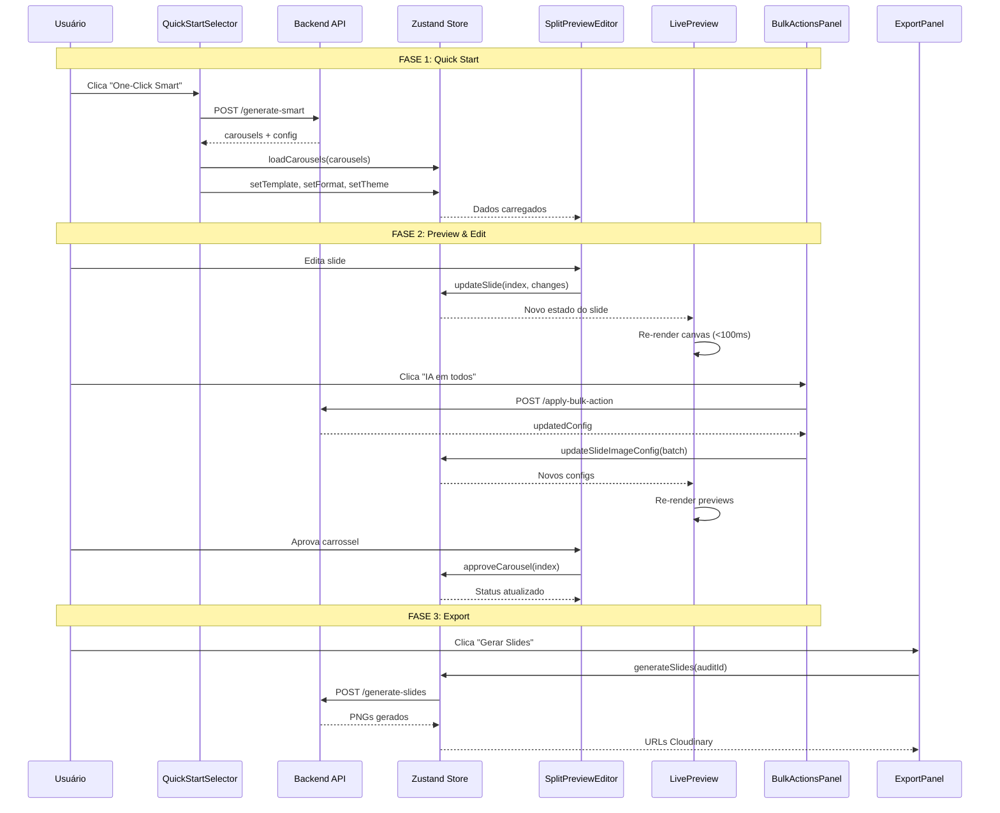

# 📊 Diagrama de Componentes - Content Flow Optimization

> **Diagrama Visual de Arquitetura**
> **Gerado com:** Mermaid
> **Última atualização:** 2026-02-23

---

## 🗂️ Hierarquia de Componentes (Mermaid)

```mermaid
graph TB
    %% Página Principal
    Page[ContentCreationPage<br/>app/dashboard/audits/[id]/create-content/page.tsx]

    %% Layout
    Layout[DashboardLayout<br/>template - já existe]
    Sidebar[Sidebar<br/>organism - já existe]

    %% Wizard Principal
    Wizard[ContentCreationWizard<br/>organism - NOVO]

    %% Progress Stepper
    Stepper[ProgressStepper<br/>molecule - NOVO]
    StepperBadge[Badge<br/>atom - existe]

    %% FASE 1: Quick Start
    QuickStart[QuickStartSelector<br/>organism - NOVO]
    QuickCard[QuickStartCard<br/>molecule - NOVO]
    QuickCardAtoms[Card + Button<br/>atoms - existem]

    TemplateGallery[TemplateGallery<br/>organism - NOVO]
    TemplateCard[TemplateCard<br/>molecule - NOVO]

    %% FASE 2: Split Preview Editor
    SplitEditor[SplitPreviewEditor<br/>organism - NOVO]

    %% Content Panel
    ContentPanel[ContentPanel<br/>molecule - NOVO]
    SlideEditor[SlideEditor<br/>molecule - NOVO]
    SlideEditorAtoms[Input + Textarea<br/>atoms]
    ImageDropdown[ImageConfigDropdown<br/>molecule - NOVO]
    BulkPanel[BulkActionsPanel<br/>organism - NOVO]
    BulkButton[Button<br/>atom - existe]

    %% Preview Panel
    PreviewPanel[PreviewPanel<br/>molecule - NOVO]
    LivePreview[LiveSlidePreview<br/>molecule - NOVO]
    Canvas[Canvas HTML5<br/>nativo]
    PreviewControls[PreviewControls<br/>molecule - NOVO]

    %% Navigator
    Navigator[CarouselNavigator<br/>molecule - NOVO]
    NavAtoms[Button + Progress<br/>atoms - existem]

    %% FASE 3: Export
    ExportPanel[ExportPanel<br/>organism - NOVO]
    ExportOptions[ExportOptions<br/>molecule - NOVO]
    ExportProgress[ExportProgress<br/>molecule - NOVO]
    ProgressAtom[Progress<br/>atom - existe]

    %% Zustand Store
    Store[(Zustand Store<br/>content-creation-store.ts)]

    %% APIs
    API1[/api/audits/[id]/generate-smart]
    API2[/api/audits/[id]/apply-bulk-action]
    API3[/api/audits/[id]/preview-slide]
    API4[/api/audits/[id]/generate-slides]

    %% Relacionamentos
    Page --> Layout
    Layout --> Sidebar
    Page --> Wizard

    Wizard --> Stepper
    Stepper --> StepperBadge

    Wizard --> QuickStart
    QuickStart --> QuickCard
    QuickCard --> QuickCardAtoms
    QuickStart --> TemplateGallery
    TemplateGallery --> TemplateCard

    Wizard --> SplitEditor

    SplitEditor --> ContentPanel
    ContentPanel --> SlideEditor
    SlideEditor --> SlideEditorAtoms
    SlideEditor --> ImageDropdown
    ContentPanel --> BulkPanel
    BulkPanel --> BulkButton

    SplitEditor --> PreviewPanel
    PreviewPanel --> LivePreview
    LivePreview --> Canvas
    PreviewPanel --> PreviewControls

    SplitEditor --> Navigator
    Navigator --> NavAtoms

    Wizard --> ExportPanel
    ExportPanel --> ExportOptions
    ExportPanel --> ExportProgress
    ExportProgress --> ProgressAtom

    %% Store connections
    QuickStart -.-> Store
    SplitEditor -.-> Store
    ExportPanel -.-> Store

    %% API connections
    QuickStart -.->|POST| API1
    BulkPanel -.->|POST| API2
    LivePreview -.->|GET| API3
    ExportPanel -.->|POST| API4

    %% Styling
    classDef organism fill:#667eea,stroke:#5a67d8,color:#fff
    classDef molecule fill:#48bb78,stroke:#38a169,color:#fff
    classDef atom fill:#ed8936,stroke:#dd6b20,color:#fff
    classDef store fill:#f56565,stroke:#e53e3e,color:#fff
    classDef api fill:#ecc94b,stroke:#d69e2e,color:#000

    class Wizard,QuickStart,TemplateGallery,SplitEditor,BulkPanel,ExportPanel organism
    class Stepper,QuickCard,TemplateCard,ContentPanel,SlideEditor,ImageDropdown,PreviewPanel,LivePreview,PreviewControls,Navigator,ExportOptions,ExportProgress molecule
    class StepperBadge,QuickCardAtoms,SlideEditorAtoms,Canvas,BulkButton,NavAtoms,ProgressAtom atom
    class Store store
    class API1,API2,API3,API4 api
```

---

## 🔄 Fluxo de Dados entre Componentes



---

## 🏗️ Estrutura de Pastas (Implementação)

```
app/
└── dashboard/
    └── audits/
        └── [id]/
            └── create-content/
                └── page.tsx              # Página principal (atualizada)

components/
├── atoms/
│   ├── badge.tsx                       # Já existe
│   ├── button.tsx                      # Já existe
│   ├── card.tsx                        # Já existe
│   ├── input.tsx                       # Já existe
│   ├── progress.tsx                    # Já existe
│   ├── skeleton.tsx                    # Já existe
│   ├── accordion.tsx                   # NOVO (shadcn/ui)
│   ├── textarea.tsx                    # NOVO
│   └── dialog.tsx                      # NOVO (shadcn/ui)
│
├── molecules/
│   ├── progress-stepper.tsx            # NOVO
│   ├── quick-start-card.tsx            # NOVO
│   ├── template-card.tsx               # NOVO
│   ├── carousel-navigator.tsx          # NOVO
│   ├── content-panel.tsx               # NOVO
│   ├── slide-editor.tsx                # NOVO
│   ├── image-config-dropdown.tsx       # NOVO
│   ├── preview-panel.tsx               # NOVO
│   ├── live-slide-preview.tsx          # NOVO ⭐
│   ├── preview-controls.tsx            # NOVO
│   ├── export-options.tsx              # NOVO
│   └── export-progress.tsx             # NOVO
│
└── organisms/
    ├── sidebar.tsx                     # Já existe
    ├── content-creation-wizard.tsx     # NOVO ⭐
    ├── quick-start-selector.tsx        # NOVO ⭐
    ├── template-gallery.tsx            # NOVO
    ├── split-preview-editor.tsx        # NOVO ⭐
    ├── bulk-actions-panel.tsx          # NOVO ⭐
    └── export-panel.tsx                # NOVO

store/
└── content-creation-store.ts           # NOVO ⭐ (Zustand)

lib/
├── slide-preview-renderer.ts           # NOVO ⭐ (Canvas rendering)
├── slide-final-renderer.ts             # NOVO (Puppeteer)
├── template-config.ts                  # NOVO (Template definitions)
└── validators/
    └── content-creation.ts             # NOVO (Zod schemas)

app/api/audits/[id]/
├── generate-smart/
│   └── route.ts                        # NOVO ⭐
├── apply-bulk-action/
│   └── route.ts                        # NOVO ⭐
├── preview-slide/
│   └── route.ts                        # NOVO
└── generate-slides/
    └── route.ts                        # Atualizar existente

types/
└── content-creation.ts                 # NOVO ⭐ (TypeScript types)
```

**Legenda:**
- ⭐ = Componente/arquivo crítico (prioridade alta)
- `# NOVO` = Precisa ser criado
- `# Já existe` = Já implementado
- `# Atualizar existente` = Modificar código existente

---

## 📦 Dependências Novas

```json
{
  "dependencies": {
    "zustand": "^4.5.0",
    "use-debounce": "^10.0.0",
    "react-window": "^1.8.10",
    "lru-cache": "^10.1.0",
    "isomorphic-dompurify": "^2.9.0",
    "zod": "^3.22.4"
  },
  "devDependencies": {
    "@types/react-window": "^1.8.8"
  }
}
```

**Instalar com:**
```bash
npm install zustand use-debounce react-window lru-cache isomorphic-dompurify zod --legacy-peer-deps
npm install -D @types/react-window --legacy-peer-deps
```

---

## 🎯 Ordem de Implementação Recomendada

### Sprint 1 (Semana 1)
1. ✅ Criar tipos TypeScript (`types/content-creation.ts`)
2. ✅ Implementar Zustand store (`store/content-creation-store.ts`)
3. ✅ Criar `QuickStartSelector` + `QuickStartCard`
4. ✅ Implementar API `/generate-smart`
5. ✅ Testes unitários do store

### Sprint 2 (Semana 2)
6. ✅ Criar `SplitPreviewEditor` (estrutura básica)
7. ✅ Implementar `ContentPanel` + `SlideEditor`
8. ✅ Criar `ProgressStepper`
9. ✅ Implementar aprovação de carrosséis
10. ✅ Testes E2E do fluxo básico

### Sprint 3 (Semana 3)
11. ✅ Implementar `LiveSlidePreview` com Canvas
12. ✅ Criar `BulkActionsPanel`
13. ✅ Implementar API `/apply-bulk-action`
14. ✅ Otimizações de performance (debounce, virtualização)
15. ✅ Keyboard shortcuts

### Sprint 4 (Semana 4)
16. ✅ Criar `TemplateGallery` + 4 templates
17. ✅ Implementar `ExportPanel`
18. ✅ Animações (Framer Motion)
19. ✅ Acessibilidade (WCAG AA)
20. ✅ Documentação

---

## 📊 Estatísticas do Projeto

| Categoria | Quantidade |
|-----------|------------|
| **Componentes Novos** | 22 |
| **APIs Novas** | 3 |
| **Tipos TypeScript** | 15+ |
| **Linhas de Código Estimadas** | ~3.500 |
| **Tempo Estimado** | 4 semanas |
| **Desenvolvedores Necessários** | 2-3 |

---

## 🔗 Links Úteis

- **Documento UX:** `docs/ux/content-creation-flow-optimization.md`
- **Documento de Arquitetura:** `docs/architecture/content-flow-architecture.md`
- **Dashboard de Progresso:** `docs/ux/implementation-dashboard.html`
- **Figma (wireframes):** [Link será adicionado]

---

**Diagrama mantido por:** Architect Agent
**Última atualização:** 2026-02-23
