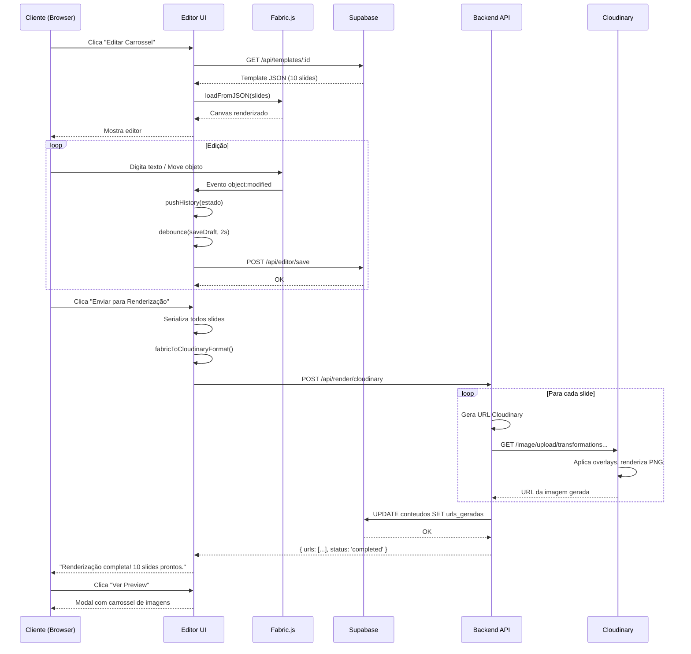

# Editor Visual de Carrosséis - Arquitetura Técnica

**Post Express - Pazos Media**
**Data:** 2026-02-16
**Versão:** 1.0
**Status:** Documento de Arquitetura

---

## Sumário Executivo

Este documento define a arquitetura técnica do Editor Visual de Carrosséis, componente que permite aos clientes editarem conteúdo gerado pelo Squad Criação antes da renderização final via Cloudinary.

**Objetivo:** Sistema web WYSIWYG para edição de carrosséis de Instagram/LinkedIn com preview em tempo real.

**Stack Principal:** Fabric.js (canvas), Supabase (backend), Cloudinary (renderização final)

---

## 1. Tecnologia Recomendada

### 1.1 Comparação de Tecnologias de Canvas

| Critério | Polotno | Fabric.js | Konva | Canvas API Puro |
|----------|---------|-----------|-------|-----------------|
| **Facilidade de Uso** | ⭐⭐⭐⭐⭐ | ⭐⭐⭐⭐ | ⭐⭐⭐ | ⭐⭐ |
| **Customização** | ⭐⭐⭐ | ⭐⭐⭐⭐⭐ | ⭐⭐⭐⭐ | ⭐⭐⭐⭐⭐ |
| **Performance** | ⭐⭐⭐⭐ | ⭐⭐⭐⭐ | ⭐⭐⭐⭐⭐ | ⭐⭐⭐⭐⭐ |
| **Export JSON** | ⭐⭐⭐⭐⭐ | ⭐⭐⭐⭐⭐ | ⭐⭐⭐ | ⭐⭐ |
| **Text Editing** | ⭐⭐⭐⭐⭐ | ⭐⭐⭐⭐ | ⭐⭐⭐ | ⭐⭐ |
| **Documentação** | ⭐⭐⭐⭐ | ⭐⭐⭐⭐⭐ | ⭐⭐⭐⭐ | ⭐⭐⭐ |
| **Comunidade** | ⭐⭐⭐ | ⭐⭐⭐⭐⭐ | ⭐⭐⭐⭐ | ⭐⭐⭐⭐⭐ |
| **Custo** | 💰💰💰 ($) | Grátis | Grátis | Grátis |
| **Bundle Size** | ~1.2MB | ~400KB | ~300KB | 0KB |

### 1.2 Análise Detalhada

#### Polotno Studio

**Pros:**
- Interface pronta para uso (drag & drop, toolbar, panels)
- Suporte nativo para templates
- Excelente UI/UX out-of-the-box
- Export para JSON, PNG, PDF
- Multi-page (slides) nativo

**Cons:**
- Licença comercial necessária ($299-$999/ano)
- Customização limitada comparada a Fabric.js
- Bundle size maior
- Vendor lock-in
- Menos controle sobre renderização

**Quando usar:** Prototipagem rápida ou MVP se budget permitir.

---

#### Fabric.js ⭐ RECOMENDADO

**Pros:**
- Open source, gratuito, MIT License
- Excelente suporte para texto (IText, Textbox)
- Serialização/deserialização JSON nativa
- API rica para manipulação de objetos
- Eventos intuitivos (object:modified, mouse:down, etc.)
- Comunidade ativa, 27k+ stars no GitHub
- Integração fácil com React/Vue/Next.js
- Export para SVG, JSON, PNG

**Cons:**
- UI precisa ser construída do zero
- Performance em canvases muito grandes pode degradar
- Requer conhecimento de canvas APIs
- Não tem sistema de plugins oficial

**Quando usar:** Projetos que precisam customização total e não querem vendor lock-in.

**Code Example:**
```javascript
import { fabric } from 'fabric';

// Inicializar canvas
const canvas = new fabric.Canvas('editor-canvas', {
  width: 1080,
  height: 1080,
  backgroundColor: '#ffffff'
});

// Adicionar texto editável
const text = new fabric.IText('Digite aqui...', {
  left: 100,
  top: 100,
  fontSize: 24,
  fontFamily: 'Inter',
  fill: '#000000'
});
canvas.add(text);

// Export JSON
const json = canvas.toJSON(['customProperty']);
console.log(json);

// Load from JSON
canvas.loadFromJSON(json, () => {
  canvas.renderAll();
});
```

---

#### Konva

**Pros:**
- Excelente performance (otimizado para animações)
- API moderna e limpa
- Suporte a camadas (Layers)
- Bom para jogos e visualizações complexas
- TypeScript support nativo

**Cons:**
- Export JSON menos robusto que Fabric.js
- Edição de texto menos intuitiva
- Menos foco em design/editing tools
- Comunidade menor para design apps

**Quando usar:** Apps com muita animação ou interatividade complexa.

---

#### Canvas API Puro

**Pros:**
- Zero dependências
- Performance máxima
- Controle total
- Bundle size = 0

**Cons:**
- Reimplementar tudo do zero (texto editável, transformações, eventos)
- Desenvolvimento muito mais lento
- Manutenção complexa
- Não escalável para equipe pequena

**Quando usar:** Apenas se requisitos forem extremamente específicos.

---

### 1.3 Decisão Final

**ESCOLHA: Fabric.js**

**Justificativa:**
1. Balance ideal entre flexibilidade e produtividade
2. Open source, sem custos de licença
3. Serialização JSON robusta (essencial para integração com Cloudinary)
4. Comunidade ativa e madura
5. Suporte excelente para edição de texto
6. Fácil integração com React/Next.js
7. Performance suficiente para 10-30 slides por carrossel
8. Permite construir exatamente o workflow que precisamos

**Trade-off Aceito:** Precisamos construir UI do zero, mas ganhamos controle total sobre UX e lógica de negócio.

---

## 2. Arquitetura de Componentes

### 2.1 Visão Geral

```
┌─────────────────────────────────────────────────────────────────┐
│                        EDITOR VISUAL                            │
│                                                                 │
│  ┌──────────────┐  ┌──────────────────────────────────────┐   │
│  │              │  │                                      │   │
│  │   Toolbar    │  │        Canvas Layer                  │   │
│  │              │  │     (Fabric.js 1080x1080)            │   │
│  │  - Text      │  │                                      │   │
│  │  - Image     │  │  ┌────────────────────────────┐     │   │
│  │  - Shapes    │  │  │                            │     │   │
│  │  - Colors    │  │  │   Slide atual sendo       │     │   │
│  │  - Fonts     │  │  │   editado                 │     │   │
│  │  - Align     │  │  │                            │     │   │
│  │  - Undo      │  │  │   (Objetos Fabric.js)     │     │   │
│  │  - Redo      │  │  │                            │     │   │
│  │              │  │  └────────────────────────────┘     │   │
│  └──────────────┘  │                                      │   │
│                    └──────────────────────────────────────┘   │
│                                                                 │
│  ┌──────────────────────────────────────────────────────────┐ │
│  │              Properties Panel (direita)                  │ │
│  │                                                          │ │
│  │  Quando objeto selecionado:                             │ │
│  │  - Font Family / Size / Weight                          │ │
│  │  - Text Color / Background                              │ │
│  │  - Line Height / Letter Spacing                         │ │
│  │  - Padding / Alignment                                  │ │
│  │  - Image Crop / Filters                                 │ │
│  └──────────────────────────────────────────────────────────┘ │
│                                                                 │
│  ┌──────────────────────────────────────────────────────────┐ │
│  │         Slides Navigator (inferior)                      │ │
│  │  [1] [2] [3] [4] [5] [6] [7] [8] [9] [10]              │ │
│  │  Thumbnails clicáveis para trocar de slide              │ │
│  └──────────────────────────────────────────────────────────┘ │
│                                                                 │
│  ┌──────────────────────────────────────────────────────────┐ │
│  │  [Preview] [Salvar Rascunho] [Enviar para Renderização] │ │
│  └──────────────────────────────────────────────────────────┘ │
└─────────────────────────────────────────────────────────────────┘
```

### 2.2 Estrutura de Componentes React

```typescript
// Componentes principais
src/
├── components/
│   ├── Editor/
│   │   ├── EditorContainer.tsx       // Container principal
│   │   ├── Canvas/
│   │   │   ├── FabricCanvas.tsx      // Wrapper do Fabric.js
│   │   │   ├── CanvasControls.tsx    // Zoom, pan, grid
│   │   │   └── ObjectHandlers.tsx    // Eventos de objetos
│   │   ├── Toolbar/
│   │   │   ├── ToolbarContainer.tsx
│   │   │   ├── TextTools.tsx
│   │   │   ├── ImageTools.tsx
│   │   │   ├── ColorPicker.tsx
│   │   │   ├── FontSelector.tsx
│   │   │   └── AlignmentTools.tsx
│   │   ├── PropertiesPanel/
│   │   │   ├── PanelContainer.tsx
│   │   │   ├── TextProperties.tsx
│   │   │   ├── ImageProperties.tsx
│   │   │   └── ShapeProperties.tsx
│   │   ├── SlidesNavigator/
│   │   │   ├── NavigatorContainer.tsx
│   │   │   ├── SlideThumb.tsx
│   │   │   └── SlideControls.tsx
│   │   └── PreviewModal/
│   │       ├── PreviewModal.tsx
│   │       └── SlideCarousel.tsx
│   └── shared/
│       ├── Button.tsx
│       ├── Input.tsx
│       └── Dropdown.tsx
├── hooks/
│   ├── useEditor.ts              // Estado global do editor
│   ├── useFabric.ts              // Wrapper Fabric.js
│   ├── useHistory.ts             // Undo/Redo
│   └── useAutoSave.ts            // Auto-save
├── stores/
│   ├── editorStore.ts            // Zustand/Redux store
│   └── historyStore.ts
├── services/
│   ├── api/
│   │   ├── templates.ts          // GET/POST templates
│   │   ├── assets.ts             // Upload de imagens
│   │   └── rendering.ts          // Cloudinary integration
│   └── fabric/
│       ├── serializer.ts         // JSON <-> Fabric
│       └── cloudinaryExporter.ts // Fabric -> Cloudinary format
└── types/
    ├── editor.ts
    ├── template.ts
    └── cloudinary.ts
```

### 2.3 Estado da Aplicação

```typescript
// editorStore.ts (Zustand)
interface EditorState {
  // Template atual
  template: Template | null;

  // Slides
  slides: Slide[];
  currentSlideIndex: number;

  // Canvas
  canvas: fabric.Canvas | null;
  selectedObject: fabric.Object | null;

  // History (Undo/Redo)
  history: HistoryEntry[];
  historyIndex: number;

  // UI State
  isPreviewOpen: boolean;
  isSaving: boolean;

  // Actions
  loadTemplate: (id: string) => Promise<void>;
  addSlide: () => void;
  deleteSlide: (index: number) => void;
  selectSlide: (index: number) => void;
  updateSlide: (index: number, data: Partial<Slide>) => void;

  // Canvas actions
  addText: (text: string) => void;
  addImage: (url: string) => void;
  updateObject: (obj: fabric.Object, props: any) => void;
  deleteObject: (obj: fabric.Object) => void;

  // History
  undo: () => void;
  redo: () => void;
  pushHistory: (entry: HistoryEntry) => void;

  // Save/Export
  saveDraft: () => Promise<void>;
  renderToCloudinary: () => Promise<string[]>;
}
```

---

## 3. Fluxo de Dados

### 3.1 Diagrama de Fluxo

```
┌─────────────────────────────────────────────────────────────────┐
│                    FLUXO DE DADOS COMPLETO                      │
└─────────────────────────────────────────────────────────────────┘

1. CRIAÇÃO INICIAL (Squad Criação → Supabase)
   ┌────────────────┐      JSON de 10 slides      ┌──────────────┐
   │ Squad Criação  │ ─────────────────────────> │   Supabase    │
   │ (Claude Code)  │                             │  (templates)  │
   └────────────────┘                             └──────────────┘
                                                          │
                                                          │ id: uuid
                                                          ▼

2. CARREGAMENTO NO EDITOR
   ┌──────────────┐      GET /api/templates/:id   ┌──────────────┐
   │ Editor UI    │ ◄─────────────────────────────│   Supabase    │
   └──────────────┘                               └──────────────┘
         │
         │ loadTemplate(json)
         ▼
   ┌──────────────────────────────────────────────┐
   │         Fabric.js Canvas                     │
   │  - Converte JSON → Objetos Fabric            │
   │  - Renderiza texto, imagens, shapes          │
   └──────────────────────────────────────────────┘

3. EDIÇÃO (Cliente edita slides)
   ┌──────────────┐      Interações do usuário
   │   Cliente    │ ──> Click, drag, type, upload
   └──────────────┘
         │
         ▼
   ┌──────────────────────────────────────────────┐
   │         Fabric.js Events                     │
   │  - object:modified                           │
   │  - object:added                              │
   │  - object:removed                            │
   └──────────────────────────────────────────────┘
         │
         │ pushHistory() - para Undo/Redo
         ▼
   ┌──────────────────────────────────────────────┐
   │      History Store (Array de estados)        │
   │  [state0, state1, state2, ...]              │
   └──────────────────────────────────────────────┘

4. AUTO-SAVE (a cada 30s ou debounced)
   ┌──────────────┐      POST /api/editor/save    ┌──────────────┐
   │ Editor       │ ─────────────────────────────> │   Supabase    │
   │ (useAutoSave)│      JSON atualizado           │  (drafts)     │
   └──────────────┘                               └──────────────┘

5. RENDERIZAÇÃO FINAL (Cliente aprova)
   ┌──────────────┐  [Enviar para Renderização]
   │ Editor UI    │ ────┐
   └──────────────┘     │
                        │ 1. Serializa todos slides para JSON
                        ▼
   ┌──────────────────────────────────────────────┐
   │   fabricToCloudinaryFormat(slides)           │
   │   - Converte Fabric.js → Cloudinary specs    │
   │   - Extrai textos, fontes, cores, posições   │
   │   - Prepara overlays para cada layer         │
   └──────────────────────────────────────────────┘
                        │
                        │ 2. POST para backend
                        ▼
   ┌──────────────┐   POST /api/render/cloudinary  ┌──────────────┐
   │ Backend API  │ ─────────────────────────────> │  Cloudinary   │
   │ (Node/Edge)  │                                │     API       │
   └──────────────┘                                └──────────────┘
                                                          │
                                                          │ 3. Renderiza PNG
                                                          │    1080x1080
                                                          ▼
   ┌──────────────────────────────────────────────┐
   │     URLs das imagens geradas                 │
   │  [slide1.png, slide2.png, ...]              │
   └──────────────────────────────────────────────┘
                        │
                        │ 4. Salva URLs no banco
                        ▼
   ┌──────────────┐                               ┌──────────────┐
   │   Backend    │ ─────────────────────────────> │   Supabase    │
   └──────────────┘   UPDATE conteudos            │  (conteudos)  │
                      status = 'renderizado'       └──────────────┘
```

### 3.2 Schema JSON de Slides

```typescript
// Formato salvo no Supabase (templates table)
interface Template {
  id: string;
  cliente_id: string;
  tipo: 'educacional' | 'vendas' | 'autoridade' | 'viral';
  titulo: string;
  slides: SlideData[];
  metadata: {
    criado_por: 'squad_criacao' | 'cliente';
    editado_em: string;
    versao: number;
  };
  created_at: string;
  updated_at: string;
}

interface SlideData {
  numero: number;
  fabricJson: string; // Fabric.js JSON serializado
  preview_url?: string; // Thumbnail do slide
  layers: Layer[]; // Para facilitar queries
}

interface Layer {
  type: 'text' | 'image' | 'shape';
  content: string;
  styles: {
    fontFamily?: string;
    fontSize?: number;
    color?: string;
    backgroundColor?: string;
    // ... outros estilos
  };
  position: {
    left: number;
    top: number;
    width: number;
    height: number;
  };
}
```

### 3.3 Sistema de Undo/Redo

```typescript
// historyStore.ts
interface HistoryEntry {
  timestamp: number;
  slideIndex: number;
  fabricJson: string; // Snapshot do canvas
  action: 'add' | 'modify' | 'delete' | 'move';
  objectId?: string;
}

class HistoryManager {
  private history: HistoryEntry[] = [];
  private currentIndex: number = -1;
  private maxHistory: number = 50;

  push(entry: HistoryEntry) {
    // Remove histórico "futuro" se estamos no meio da linha
    this.history = this.history.slice(0, this.currentIndex + 1);

    // Adiciona novo estado
    this.history.push(entry);

    // Limita tamanho
    if (this.history.length > this.maxHistory) {
      this.history.shift();
    } else {
      this.currentIndex++;
    }
  }

  undo(canvas: fabric.Canvas) {
    if (this.currentIndex > 0) {
      this.currentIndex--;
      const entry = this.history[this.currentIndex];
      canvas.loadFromJSON(entry.fabricJson, () => {
        canvas.renderAll();
      });
    }
  }

  redo(canvas: fabric.Canvas) {
    if (this.currentIndex < this.history.length - 1) {
      this.currentIndex++;
      const entry = this.history[this.currentIndex];
      canvas.loadFromJSON(entry.fabricJson, () => {
        canvas.renderAll();
      });
    }
  }

  canUndo(): boolean {
    return this.currentIndex > 0;
  }

  canRedo(): boolean {
    return this.currentIndex < this.history.length - 1;
  }
}
```

**Otimização:** Debounce push de 500ms para evitar criar histórico a cada keystroke.

---

## 4. Schema de Banco de Dados

### 4.1 Novas Tabelas

```sql
-- =====================================================
-- TABELA: templates
-- Armazena JSONs de carrosséis criados pelo Squad ou editados
-- =====================================================
CREATE TABLE public.templates (
  id UUID PRIMARY KEY DEFAULT gen_random_uuid(),
  cliente_id UUID NOT NULL REFERENCES public.clientes(id) ON DELETE CASCADE,

  -- Metadados
  tipo TEXT NOT NULL CHECK (tipo IN ('educacional', 'vendas', 'autoridade', 'viral')),
  titulo TEXT NOT NULL,
  descricao TEXT,

  -- Dados do carrossel
  slides JSONB NOT NULL, -- Array de SlideData
  total_slides INTEGER GENERATED ALWAYS AS (jsonb_array_length(slides)) STORED,

  -- Tracking
  criado_por TEXT NOT NULL CHECK (criado_por IN ('squad_criacao', 'cliente')),
  versao INTEGER DEFAULT 1,
  template_pai_id UUID REFERENCES public.templates(id), -- Se for versão editada

  -- Timestamps
  created_at TIMESTAMP WITH TIME ZONE DEFAULT NOW(),
  updated_at TIMESTAMP WITH TIME ZONE DEFAULT NOW()
);

-- Índices
CREATE INDEX idx_templates_cliente ON public.templates(cliente_id);
CREATE INDEX idx_templates_tipo ON public.templates(tipo);
CREATE INDEX idx_templates_updated ON public.templates(updated_at DESC);

-- =====================================================
-- TABELA: editor_sessions
-- Armazena sessões de edição (para recovery e analytics)
-- =====================================================
CREATE TABLE public.editor_sessions (
  id UUID PRIMARY KEY DEFAULT gen_random_uuid(),
  template_id UUID NOT NULL REFERENCES public.templates(id) ON DELETE CASCADE,
  cliente_id UUID NOT NULL REFERENCES public.clientes(id) ON DELETE CASCADE,

  -- Estado da sessão
  estado_atual JSONB NOT NULL, -- Snapshot do editor
  duracao_segundos INTEGER DEFAULT 0,
  mudancas_totais INTEGER DEFAULT 0,

  -- Status
  finalizada BOOLEAN DEFAULT FALSE,

  -- Timestamps
  iniciada_em TIMESTAMP WITH TIME ZONE DEFAULT NOW(),
  finalizada_em TIMESTAMP WITH TIME ZONE
);

CREATE INDEX idx_sessions_template ON public.editor_sessions(template_id);
CREATE INDEX idx_sessions_cliente ON public.editor_sessions(cliente_id);

-- =====================================================
-- TABELA: assets
-- Armazena uploads de imagens dos clientes
-- =====================================================
CREATE TABLE public.assets (
  id UUID PRIMARY KEY DEFAULT gen_random_uuid(),
  cliente_id UUID NOT NULL REFERENCES public.clientes(id) ON DELETE CASCADE,

  -- Arquivo
  tipo TEXT NOT NULL CHECK (tipo IN ('image', 'logo', 'background')),
  url TEXT NOT NULL, -- URL no Cloudinary ou Supabase Storage
  nome_original TEXT NOT NULL,
  mime_type TEXT NOT NULL,
  tamanho_bytes INTEGER NOT NULL,

  -- Dimensões (se imagem)
  largura INTEGER,
  altura INTEGER,

  -- Metadados
  usado_em JSONB, -- Array de template_ids onde foi usado
  tags TEXT[], -- Para busca

  -- Timestamps
  created_at TIMESTAMP WITH TIME ZONE DEFAULT NOW()
);

CREATE INDEX idx_assets_cliente ON public.assets(cliente_id);
CREATE INDEX idx_assets_tipo ON public.assets(tipo);
CREATE INDEX idx_assets_tags ON public.assets USING GIN(tags);

-- =====================================================
-- TABELA: render_queue
-- Fila de renderizações Cloudinary
-- =====================================================
CREATE TABLE public.render_queue (
  id UUID PRIMARY KEY DEFAULT gen_random_uuid(),
  template_id UUID NOT NULL REFERENCES public.templates(id) ON DELETE CASCADE,
  cliente_id UUID NOT NULL REFERENCES public.clientes(id) ON DELETE CASCADE,

  -- Dados da renderização
  slides_json JSONB NOT NULL, -- JSON formatado para Cloudinary
  total_slides INTEGER NOT NULL,

  -- Status
  status TEXT NOT NULL CHECK (status IN ('pending', 'processing', 'completed', 'failed')),
  erro_mensagem TEXT,
  tentativas INTEGER DEFAULT 0,

  -- Resultado
  urls_geradas TEXT[], -- Array de URLs das imagens renderizadas
  tempo_processamento_segundos INTEGER,

  -- Timestamps
  created_at TIMESTAMP WITH TIME ZONE DEFAULT NOW(),
  started_at TIMESTAMP WITH TIME ZONE,
  completed_at TIMESTAMP WITH TIME ZONE
);

CREATE INDEX idx_render_status ON public.render_queue(status);
CREATE INDEX idx_render_template ON public.render_queue(template_id);
```

### 4.2 Alterações em Tabelas Existentes

```sql
-- =====================================================
-- TABELA: clientes (adicionar campos para editor)
-- =====================================================
ALTER TABLE public.clientes
ADD COLUMN preferencias_editor JSONB DEFAULT '{
  "fonte_padrao": "Inter",
  "cores_marca": ["#000000", "#FFFFFF"],
  "templates_favoritos": []
}'::jsonb;

-- =====================================================
-- TABELA: conteudos (adicionar referência a template)
-- =====================================================
ALTER TABLE public.conteudos
ADD COLUMN template_id UUID REFERENCES public.templates(id),
ADD COLUMN renderizado_em TIMESTAMP WITH TIME ZONE,
ADD COLUMN tempo_edicao_segundos INTEGER DEFAULT 0;

CREATE INDEX idx_conteudos_template ON public.conteudos(template_id);
```

### 4.3 Row Level Security (RLS)

```sql
-- =====================================================
-- RLS: templates
-- =====================================================
ALTER TABLE public.templates ENABLE ROW LEVEL SECURITY;

-- Clientes só veem seus próprios templates
CREATE POLICY "Clientes podem ver seus templates"
  ON public.templates
  FOR SELECT
  USING (cliente_id = auth.uid());

-- Clientes podem criar templates
CREATE POLICY "Clientes podem criar templates"
  ON public.templates
  FOR INSERT
  WITH CHECK (cliente_id = auth.uid());

-- Clientes podem editar seus templates
CREATE POLICY "Clientes podem editar seus templates"
  ON public.templates
  FOR UPDATE
  USING (cliente_id = auth.uid());

-- Admin pode ver tudo
CREATE POLICY "Admin vê tudo"
  ON public.templates
  FOR ALL
  USING (
    EXISTS (
      SELECT 1 FROM public.clientes
      WHERE id = auth.uid() AND role = 'admin'
    )
  );

-- =====================================================
-- RLS: assets
-- =====================================================
ALTER TABLE public.assets ENABLE ROW LEVEL SECURITY;

CREATE POLICY "Clientes veem seus assets"
  ON public.assets FOR SELECT
  USING (cliente_id = auth.uid());

CREATE POLICY "Clientes podem fazer upload"
  ON public.assets FOR INSERT
  WITH CHECK (cliente_id = auth.uid());

-- =====================================================
-- RLS: render_queue
-- =====================================================
ALTER TABLE public.render_queue ENABLE ROW LEVEL SECURITY;

CREATE POLICY "Clientes veem suas renderizações"
  ON public.render_queue FOR SELECT
  USING (cliente_id = auth.uid());
```

---

## 5. API Endpoints

### 5.1 Templates API

```typescript
// GET /api/templates/:id
// Carrega template para edição
interface GetTemplateResponse {
  id: string;
  titulo: string;
  tipo: string;
  slides: SlideData[];
  metadata: {
    versao: number;
    criado_por: string;
    updated_at: string;
  };
}

// POST /api/templates
// Cria novo template (Squad Criação)
interface CreateTemplateRequest {
  cliente_id: string;
  tipo: 'educacional' | 'vendas' | 'autoridade' | 'viral';
  titulo: string;
  slides: SlideData[];
}

// PUT /api/templates/:id
// Atualiza template existente (Editor)
interface UpdateTemplateRequest {
  slides: SlideData[];
  versao?: number; // Incrementa versão se mudanças significativas
}

// GET /api/templates/cliente/:cliente_id
// Lista todos templates de um cliente
interface ListTemplatesResponse {
  templates: {
    id: string;
    titulo: string;
    tipo: string;
    total_slides: number;
    preview_url: string; // Thumbnail do primeiro slide
    updated_at: string;
  }[];
  total: number;
}
```

### 5.2 Editor API

```typescript
// POST /api/editor/save
// Auto-save durante edição
interface SaveDraftRequest {
  template_id: string;
  slides: SlideData[];
  session_id: string;
}

interface SaveDraftResponse {
  success: boolean;
  saved_at: string;
  versao: number;
}

// POST /api/editor/session/start
// Inicia sessão de edição
interface StartSessionRequest {
  template_id: string;
  cliente_id: string;
}

interface StartSessionResponse {
  session_id: string;
  template: GetTemplateResponse;
}

// POST /api/editor/session/end
// Finaliza sessão
interface EndSessionRequest {
  session_id: string;
  duracao_segundos: number;
  mudancas_totais: number;
}

// GET /api/editor/history/:template_id
// Histórico de versões
interface HistoryResponse {
  versoes: {
    versao: number;
    updated_at: string;
    criado_por: string;
    mudancas: string; // Descrição das mudanças
  }[];
}
```

### 5.3 Assets API

```typescript
// POST /api/assets/upload
// Upload de imagem (multipart/form-data)
interface UploadAssetRequest {
  file: File;
  tipo: 'image' | 'logo' | 'background';
  tags?: string[];
}

interface UploadAssetResponse {
  id: string;
  url: string;
  largura: number;
  altura: number;
  tamanho_bytes: number;
}

// GET /api/assets/cliente/:cliente_id
// Lista assets do cliente
interface ListAssetsResponse {
  assets: {
    id: string;
    url: string;
    tipo: string;
    nome_original: string;
    largura: number;
    altura: number;
    created_at: string;
  }[];
}

// DELETE /api/assets/:id
// Remove asset
```

### 5.4 Rendering API

```typescript
// POST /api/render/cloudinary
// Trigger renderização Cloudinary
interface RenderRequest {
  template_id: string;
  slides: CloudinarySlideSpec[]; // Formato específico Cloudinary
  opcoes?: {
    formato: 'png' | 'jpg';
    qualidade: number; // 1-100
    dimensoes: {
      width: number;
      height: number;
    };
  };
}

interface CloudinarySlideSpec {
  slide_numero: number;
  background_color: string;
  layers: CloudinaryLayer[];
}

interface CloudinaryLayer {
  type: 'text' | 'image';
  content: string;
  position: { x: number; y: number };
  styles: {
    font_family?: string;
    font_size?: number;
    color?: string;
    text_align?: 'left' | 'center' | 'right';
    // ... outros
  };
}

interface RenderResponse {
  job_id: string;
  status: 'pending' | 'processing';
  estimated_time_seconds: number;
}

// GET /api/render/status/:job_id
// Verifica status da renderização
interface RenderStatusResponse {
  job_id: string;
  status: 'pending' | 'processing' | 'completed' | 'failed';
  progresso: number; // 0-100
  urls_geradas?: string[]; // Se completed
  erro_mensagem?: string; // Se failed
}
```

---

## 6. Integração com Cloudinary

### 6.1 Fluxo de Renderização

```
Editor (Fabric.js) → Serializer → Cloudinary API → PNG URLs
```

### 6.2 Conversão Fabric.js → Cloudinary

```typescript
// services/fabric/cloudinaryExporter.ts

interface FabricObject {
  type: string;
  left: number;
  top: number;
  width: number;
  height: number;
  // ... propriedades Fabric.js
}

interface CloudinaryTransformation {
  overlay: string;
  gravity: string;
  x: number;
  y: number;
  width?: number;
  height?: number;
  color?: string;
  // ...
}

class CloudinaryExporter {
  /**
   * Converte um slide Fabric.js para formato Cloudinary
   */
  exportSlide(fabricJson: string): CloudinarySlideSpec {
    const canvas = JSON.parse(fabricJson);
    const layers: CloudinaryLayer[] = [];

    // Processa cada objeto do canvas
    canvas.objects.forEach((obj: FabricObject) => {
      if (obj.type === 'i-text' || obj.type === 'textbox') {
        layers.push(this.exportText(obj));
      } else if (obj.type === 'image') {
        layers.push(this.exportImage(obj));
      } else if (obj.type === 'rect' || obj.type === 'circle') {
        layers.push(this.exportShape(obj));
      }
    });

    return {
      slide_numero: 1,
      background_color: canvas.backgroundColor || '#ffffff',
      layers
    };
  }

  private exportText(obj: any): CloudinaryLayer {
    return {
      type: 'text',
      content: obj.text,
      position: {
        x: obj.left,
        y: obj.top
      },
      styles: {
        font_family: obj.fontFamily,
        font_size: obj.fontSize,
        font_weight: obj.fontWeight,
        color: obj.fill,
        text_align: obj.textAlign,
        line_height: obj.lineHeight,
        letter_spacing: obj.charSpacing
      }
    };
  }

  private exportImage(obj: any): CloudinaryLayer {
    // Upload imagem para Cloudinary se ainda não estiver lá
    const cloudinaryPublicId = this.getOrUploadImage(obj.src);

    return {
      type: 'image',
      content: cloudinaryPublicId,
      position: {
        x: obj.left,
        y: obj.top
      },
      styles: {
        width: obj.width * obj.scaleX,
        height: obj.height * obj.scaleY,
        opacity: obj.opacity,
        // Crop, filters, etc
      }
    };
  }

  /**
   * Gera URL Cloudinary com transformações
   */
  generateCloudinaryUrl(spec: CloudinarySlideSpec): string {
    const baseUrl = `https://res.cloudinary.com/${CLOUD_NAME}/image/upload`;

    // Construir transformações
    const transformations = spec.layers.map(layer => {
      if (layer.type === 'text') {
        return this.buildTextOverlay(layer);
      } else {
        return this.buildImageOverlay(layer);
      }
    }).join('/');

    // Background base (canvas branco ou cor)
    const background = `b_${spec.background_color.replace('#', 'rgb:')}`;

    return `${baseUrl}/${transformations}/${background}/slide_${spec.slide_numero}.png`;
  }

  private buildTextOverlay(layer: CloudinaryLayer): string {
    const { content, position, styles } = layer;

    // Encode texto
    const encodedText = encodeURIComponent(content);

    // Construir string de transformação
    const parts = [
      `l_text:${styles.font_family}_${styles.font_size}:${encodedText}`,
      `co_${styles.color?.replace('#', 'rgb:')}`,
      `g_north_west`, // Gravity
      `x_${Math.round(position.x)}`,
      `y_${Math.round(position.y)}`
    ];

    return parts.join(',');
  }

  private buildImageOverlay(layer: CloudinaryLayer): string {
    const { content, position, styles } = layer;

    return [
      `l_${content}`, // public_id da imagem
      `w_${styles.width}`,
      `h_${styles.height}`,
      `g_north_west`,
      `x_${Math.round(position.x)}`,
      `y_${Math.round(position.y)}`
    ].join(',');
  }
}
```

### 6.3 Exemplo de URL Cloudinary Gerada

```
https://res.cloudinary.com/pazos-media/image/upload/
  l_text:Inter_48_bold:5%20Erros%20Que%20Matam%20Seu%20Engajamento,
  co_rgb:000000,
  g_north_west,
  x_100,
  y_200/
  l_logo_frankcosta,
  w_80,
  h_80,
  g_north_west,
  x_50,
  y_50/
  b_rgb:ffffff/
  w_1080,
  h_1080,
  c_fill/
  slide_1.png
```

### 6.4 Otimizações de Performance

```typescript
// Batch rendering de todos slides
async function renderAllSlides(slides: SlideData[]): Promise<string[]> {
  const batchSize = 5; // Renderizar 5 por vez para não sobrecarregar
  const results: string[] = [];

  for (let i = 0; i < slides.length; i += batchSize) {
    const batch = slides.slice(i, i + batchSize);

    const urls = await Promise.all(
      batch.map(slide => renderSlideToCloudinary(slide))
    );

    results.push(...urls);
  }

  return results;
}

// Cache de transformações
const transformCache = new Map<string, string>();

function getCachedTransformation(slideJson: string): string | null {
  const hash = hashString(slideJson);
  return transformCache.get(hash) || null;
}
```

### 6.5 Caching Strategy

```typescript
// Service Worker para cache de assets
const CACHE_NAME = 'editor-assets-v1';
const CACHE_DURATION = 24 * 60 * 60 * 1000; // 24h

self.addEventListener('fetch', (event) => {
  const url = new URL(event.request.url);

  // Cache imagens do Cloudinary
  if (url.hostname.includes('cloudinary.com')) {
    event.respondWith(
      caches.open(CACHE_NAME).then(cache => {
        return cache.match(event.request).then(response => {
          if (response) {
            // Verifica se cache ainda é válido
            const cachedTime = response.headers.get('cached-at');
            if (Date.now() - Number(cachedTime) < CACHE_DURATION) {
              return response;
            }
          }

          // Fetch novo
          return fetch(event.request).then(networkResponse => {
            // Adiciona timestamp ao cache
            const responseToCache = networkResponse.clone();
            responseToCache.headers.append('cached-at', String(Date.now()));
            cache.put(event.request, responseToCache);
            return networkResponse;
          });
        });
      })
    );
  }
});
```

---

## 7. Performance e Otimizações

### 7.1 Lazy Loading de Slides

```typescript
// SlidesNavigator.tsx
const SlidesNavigator: React.FC = () => {
  const slides = useEditorStore(state => state.slides);

  // Renderiza apenas slides visíveis no viewport
  const [visibleRange, setVisibleRange] = useState({ start: 0, end: 10 });

  const containerRef = useRef<HTMLDivElement>(null);

  useEffect(() => {
    const observer = new IntersectionObserver(
      (entries) => {
        entries.forEach(entry => {
          if (entry.isIntersecting) {
            const index = Number(entry.target.getAttribute('data-index'));
            // Carrega thumbnail se ainda não carregou
            loadThumbnail(index);
          }
        });
      },
      { rootMargin: '200px' } // Pré-carrega 200px antes
    );

    // Observa cada thumbnail
    const thumbs = containerRef.current?.querySelectorAll('.slide-thumb');
    thumbs?.forEach(thumb => observer.observe(thumb));

    return () => observer.disconnect();
  }, [slides]);

  return (
    <div ref={containerRef} className="slides-navigator">
      {slides.map((slide, index) => (
        <SlideThumb
          key={slide.id}
          slide={slide}
          index={index}
          data-index={index}
        />
      ))}
    </div>
  );
};
```

### 7.2 Debouncing de Edições

```typescript
// hooks/useAutoSave.ts
import { debounce } from 'lodash';
import { useEffect, useCallback } from 'react';

export function useAutoSave(template_id: string) {
  const slides = useEditorStore(state => state.slides);

  // Debounce de 2 segundos
  const saveToBackend = useCallback(
    debounce(async (slides: SlideData[]) => {
      try {
        await fetch(`/api/editor/save`, {
          method: 'POST',
          headers: { 'Content-Type': 'application/json' },
          body: JSON.stringify({
            template_id,
            slides
          })
        });
        console.log('✅ Auto-saved');
      } catch (error) {
        console.error('❌ Auto-save failed:', error);
      }
    }, 2000),
    [template_id]
  );

  useEffect(() => {
    saveToBackend(slides);
  }, [slides]);

  // Cleanup
  useEffect(() => {
    return () => {
      saveToBackend.cancel();
    };
  }, []);
}
```

### 7.3 Cache de Assets

```typescript
// services/assetsCache.ts
class AssetsCache {
  private cache = new Map<string, HTMLImageElement>();
  private maxSize = 50; // Máximo 50 imagens em memória

  async preloadImage(url: string): Promise<HTMLImageElement> {
    // Verifica cache
    if (this.cache.has(url)) {
      return this.cache.get(url)!;
    }

    // Carrega imagem
    const img = new Image();
    img.crossOrigin = 'anonymous';

    return new Promise((resolve, reject) => {
      img.onload = () => {
        // Adiciona ao cache
        this.cache.set(url, img);

        // Limita tamanho do cache (LRU)
        if (this.cache.size > this.maxSize) {
          const firstKey = this.cache.keys().next().value;
          this.cache.delete(firstKey);
        }

        resolve(img);
      };
      img.onerror = reject;
      img.src = url;
    });
  }

  preloadBatch(urls: string[]) {
    return Promise.all(urls.map(url => this.preloadImage(url)));
  }
}

export const assetsCache = new AssetsCache();
```

### 7.4 Image Optimization

```typescript
// Otimiza uploads antes de enviar
async function optimizeImage(file: File): Promise<Blob> {
  const img = await createImageBitmap(file);

  // Resize se muito grande
  const maxWidth = 2000;
  const maxHeight = 2000;

  let { width, height } = img;

  if (width > maxWidth || height > maxHeight) {
    const ratio = Math.min(maxWidth / width, maxHeight / height);
    width *= ratio;
    height *= ratio;
  }

  // Canvas para resize
  const canvas = document.createElement('canvas');
  canvas.width = width;
  canvas.height = height;
  const ctx = canvas.getContext('2d')!;
  ctx.drawImage(img, 0, 0, width, height);

  // Converte para Blob com compressão
  return new Promise(resolve => {
    canvas.toBlob(
      blob => resolve(blob!),
      'image/jpeg',
      0.85 // 85% qualidade
    );
  });
}
```

### 7.5 Performance Benchmarks

| Operação | Tempo Esperado | Como Medir |
|----------|----------------|------------|
| Carregar template (10 slides) | < 1s | `performance.mark()` |
| Trocar de slide | < 100ms | Render time |
| Adicionar texto | < 50ms | Event handler |
| Upload de imagem (2MB) | < 3s | Upload progress |
| Renderização Cloudinary (1 slide) | < 2s | API response time |
| Renderização completa (10 slides) | < 15s | Total batch time |
| Auto-save | < 500ms | Network latency |

---

## 8. Security

### 8.1 Validação de Inputs

```typescript
// validators/editor.ts
import { z } from 'zod';

const SlideDataSchema = z.object({
  numero: z.number().int().min(1),
  fabricJson: z.string().max(1000000), // Max 1MB de JSON
  layers: z.array(z.object({
    type: z.enum(['text', 'image', 'shape']),
    content: z.string().max(10000), // Max 10k chars
    styles: z.record(z.any()),
    position: z.object({
      left: z.number(),
      top: z.number(),
      width: z.number(),
      height: z.number()
    })
  }))
});

const TemplateSchema = z.object({
  cliente_id: z.string().uuid(),
  tipo: z.enum(['educacional', 'vendas', 'autoridade', 'viral']),
  titulo: z.string().min(1).max(200),
  slides: z.array(SlideDataSchema).min(1).max(30) // Max 30 slides
});

export function validateTemplate(data: unknown) {
  return TemplateSchema.parse(data);
}
```

### 8.2 Rate Limiting

```typescript
// middleware/rateLimit.ts
import rateLimit from 'express-rate-limit';

// Rate limit para uploads
export const uploadLimiter = rateLimit({
  windowMs: 15 * 60 * 1000, // 15 minutos
  max: 20, // Máximo 20 uploads por 15min
  message: 'Muitos uploads. Tente novamente em 15 minutos.'
});

// Rate limit para auto-save
export const saveLimiter = rateLimit({
  windowMs: 1 * 60 * 1000, // 1 minuto
  max: 30, // Máximo 30 saves por minuto (1 a cada 2s)
  skipSuccessfulRequests: true
});

// Rate limit para renderizações
export const renderLimiter = rateLimit({
  windowMs: 60 * 60 * 1000, // 1 hora
  max: 10, // Máximo 10 renderizações por hora
  message: 'Limite de renderizações atingido. Tente novamente em 1 hora.'
});
```

### 8.3 File Upload Security

```typescript
// middleware/uploadSecurity.ts
import multer from 'multer';
import path from 'path';
import crypto from 'crypto';

// Whitelist de MIME types
const ALLOWED_MIME_TYPES = [
  'image/jpeg',
  'image/png',
  'image/webp',
  'image/gif'
];

// Max 10MB
const MAX_FILE_SIZE = 10 * 1024 * 1024;

// Configuração Multer
export const upload = multer({
  storage: multer.memoryStorage(), // Armazena em memória para processar
  limits: {
    fileSize: MAX_FILE_SIZE,
    files: 1 // 1 arquivo por vez
  },
  fileFilter: (req, file, cb) => {
    // Valida MIME type
    if (!ALLOWED_MIME_TYPES.includes(file.mimetype)) {
      return cb(new Error('Tipo de arquivo não permitido'));
    }

    // Valida extensão
    const ext = path.extname(file.originalname).toLowerCase();
    if (!['.jpg', '.jpeg', '.png', '.webp', '.gif'].includes(ext)) {
      return cb(new Error('Extensão de arquivo inválida'));
    }

    cb(null, true);
  }
});

// Sanitiza nome do arquivo
export function sanitizeFilename(filename: string): string {
  // Remove caracteres especiais
  const sanitized = filename.replace(/[^a-zA-Z0-9.-]/g, '_');

  // Adiciona hash único
  const hash = crypto.randomBytes(8).toString('hex');
  const ext = path.extname(sanitized);
  const name = path.basename(sanitized, ext);

  return `${name}_${hash}${ext}`;
}

// Valida imagem (não é malware disfarçado)
export async function validateImage(buffer: Buffer): Promise<boolean> {
  // Verifica magic bytes (header do arquivo)
  const magicNumbers: { [key: string]: number[] } = {
    jpeg: [0xFF, 0xD8, 0xFF],
    png: [0x89, 0x50, 0x4E, 0x47],
    gif: [0x47, 0x49, 0x46, 0x38],
    webp: [0x52, 0x49, 0x46, 0x46] // "RIFF"
  };

  for (const [type, bytes] of Object.entries(magicNumbers)) {
    if (buffer.slice(0, bytes.length).every((byte, i) => byte === bytes[i])) {
      return true;
    }
  }

  return false;
}
```

### 8.4 RLS do Supabase

```typescript
// lib/supabase.ts
import { createClient } from '@supabase/supabase-js';

// Cliente com RLS automático (usa auth.uid())
export const supabaseClient = createClient(
  process.env.SUPABASE_URL!,
  process.env.SUPABASE_ANON_KEY! // Anon key = RLS ativo
);

// Service role para operações admin (sem RLS)
export const supabaseAdmin = createClient(
  process.env.SUPABASE_URL!,
  process.env.SUPABASE_SERVICE_ROLE_KEY!, // Bypass RLS
  {
    auth: {
      autoRefreshToken: false,
      persistSession: false
    }
  }
);

// Exemplo de uso com RLS
async function getTemplates(clienteId: string) {
  // RLS garante que só templates do clienteId são retornados
  const { data, error } = await supabaseClient
    .from('templates')
    .select('*')
    .eq('cliente_id', clienteId);

  return data;
}
```

### 8.5 Content Security Policy (CSP)

```typescript
// middleware/csp.ts
export function cspHeaders() {
  return {
    'Content-Security-Policy': [
      "default-src 'self'",
      "script-src 'self' 'unsafe-inline' 'unsafe-eval'", // Fabric.js precisa eval
      "style-src 'self' 'unsafe-inline' https://fonts.googleapis.com",
      "font-src 'self' https://fonts.gstatic.com",
      "img-src 'self' data: blob: https://res.cloudinary.com https://*.supabase.co",
      "connect-src 'self' https://*.supabase.co https://api.cloudinary.com",
      "frame-ancestors 'none'",
      "base-uri 'self'",
      "form-action 'self'"
    ].join('; ')
  };
}
```

---

## 9. Requisitos Técnicos

### 9.1 Browser Compatibility

| Browser | Versão Mínima | Notas |
|---------|---------------|-------|
| Chrome | 90+ | Recomendado |
| Firefox | 88+ | Suportado |
| Safari | 14+ | Suportado (alguns bugs CSS) |
| Edge | 90+ | Suportado |
| Mobile Safari | iOS 14+ | Funcional mas UX limitada |
| Chrome Android | 90+ | Funcional mas UX limitada |

**Recursos Necessários:**
- Canvas API
- WebP support
- ES6 modules
- Fetch API
- IntersectionObserver
- ResizeObserver

**Fallbacks:**
- Polyfill para IntersectionObserver (Safari antigo)
- PNG fallback se WebP não suportado

### 9.2 Mobile Responsiveness

```typescript
// Detecção de dispositivo
const isMobile = /iPhone|iPad|iPod|Android/i.test(navigator.userAgent);
const isTablet = /(iPad|Android(?!.*Mobile))/i.test(navigator.userAgent);

if (isMobile && !isTablet) {
  // Mostra warning
  showMobileWarning(
    'Para melhor experiência, recomendamos usar desktop ou tablet.'
  );

  // Simplifica UI
  hideAdvancedTools();
  enableTouchGestures();
}

// Touch gestures para mobile
const hammer = new Hammer(canvasElement);

hammer.get('pinch').set({ enable: true });
hammer.on('pinch', (e) => {
  // Zoom com pinch
  const scale = canvas.getZoom() * e.scale;
  canvas.setZoom(Math.min(Math.max(scale, 0.5), 3));
});

hammer.on('pan', (e) => {
  // Pan com 2 dedos
  if (e.pointerType === 'touch' && e.maxPointers === 2) {
    const delta = new fabric.Point(e.deltaX, e.deltaY);
    canvas.relativePan(delta);
  }
});
```

**Layout Responsivo:**
```css
/* Desktop: Sidebar + Canvas + Properties */
@media (min-width: 1024px) {
  .editor-layout {
    display: grid;
    grid-template-columns: 280px 1fr 320px;
    grid-template-rows: 60px 1fr 120px;
    grid-template-areas:
      "toolbar toolbar toolbar"
      "sidebar canvas properties"
      "sidebar navigator navigator";
  }
}

/* Tablet: Sidebar colapsável */
@media (min-width: 768px) and (max-width: 1023px) {
  .editor-layout {
    grid-template-columns: 60px 1fr;
    grid-template-areas:
      "toolbar toolbar"
      "sidebar canvas"
      "navigator navigator";
  }

  .properties-panel {
    position: fixed;
    right: -320px;
    transition: right 0.3s;
  }

  .properties-panel.open {
    right: 0;
  }
}

/* Mobile: Stack vertical */
@media (max-width: 767px) {
  .editor-layout {
    grid-template-columns: 1fr;
    grid-template-rows: 60px 1fr 80px;
    grid-template-areas:
      "toolbar"
      "canvas"
      "navigator";
  }

  .sidebar,
  .properties-panel {
    display: none; /* Simplifica UI */
  }
}
```

### 9.3 Acessibilidade (a11y)

```typescript
// Keyboard shortcuts
useEffect(() => {
  const handleKeyDown = (e: KeyboardEvent) => {
    // Undo/Redo
    if (e.metaKey || e.ctrlKey) {
      if (e.key === 'z') {
        e.preventDefault();
        if (e.shiftKey) {
          redo();
        } else {
          undo();
        }
      }

      // Save
      if (e.key === 's') {
        e.preventDefault();
        saveDraft();
      }

      // Copy/Paste
      if (e.key === 'c') {
        e.preventDefault();
        copySelectedObject();
      }

      if (e.key === 'v') {
        e.preventDefault();
        pasteObject();
      }
    }

    // Delete
    if (e.key === 'Delete' || e.key === 'Backspace') {
      deleteSelectedObject();
    }

    // Arrow keys para mover objeto
    if (['ArrowUp', 'ArrowDown', 'ArrowLeft', 'ArrowRight'].includes(e.key)) {
      e.preventDefault();
      moveSelectedObject(e.key);
    }
  };

  window.addEventListener('keydown', handleKeyDown);
  return () => window.removeEventListener('keydown', handleKeyDown);
}, []);

// ARIA labels
<button
  aria-label="Adicionar texto ao slide"
  onClick={addText}
>
  <TextIcon />
</button>

<div
  role="region"
  aria-label="Canvas de edição do slide"
  aria-live="polite"
>
  <canvas id="editor-canvas" />
</div>

// Anúncios para screen readers
const announce = (message: string) => {
  const announcer = document.getElementById('aria-announcer');
  if (announcer) {
    announcer.textContent = message;
  }
};

// Exemplo
announce('Texto adicionado ao slide 3');
announce('Slide salvo com sucesso');
```

**Checklist a11y:**
- [ ] Todos botões têm `aria-label`
- [ ] Navegação por teclado funciona
- [ ] Foco visível em elementos interativos
- [ ] Contraste de cores WCAG AA (4.5:1)
- [ ] Avisos importantes anunciados para screen readers
- [ ] Atalhos de teclado documentados
- [ ] Formulários têm labels associados

### 9.4 Performance Benchmarks

```typescript
// monitoring/performance.ts
class PerformanceMonitor {
  private metrics: Map<string, number[]> = new Map();

  measure(operation: string, fn: () => any) {
    const start = performance.now();
    const result = fn();
    const duration = performance.now() - start;

    // Registra métrica
    if (!this.metrics.has(operation)) {
      this.metrics.set(operation, []);
    }
    this.metrics.get(operation)!.push(duration);

    // Log se muito lento
    if (duration > this.getThreshold(operation)) {
      console.warn(`⚠️ ${operation} took ${duration.toFixed(2)}ms`);
    }

    return result;
  }

  async measureAsync(operation: string, fn: () => Promise<any>) {
    const start = performance.now();
    const result = await fn();
    const duration = performance.now() - start;

    if (!this.metrics.has(operation)) {
      this.metrics.set(operation, []);
    }
    this.metrics.get(operation)!.push(duration);

    if (duration > this.getThreshold(operation)) {
      console.warn(`⚠️ ${operation} took ${duration.toFixed(2)}ms`);
    }

    return result;
  }

  private getThreshold(operation: string): number {
    const thresholds: { [key: string]: number } = {
      'load_template': 1000,
      'switch_slide': 100,
      'add_text': 50,
      'upload_image': 3000,
      'render_cloudinary': 2000,
      'auto_save': 500
    };

    return thresholds[operation] || 1000;
  }

  getReport() {
    const report: { [key: string]: any } = {};

    this.metrics.forEach((times, operation) => {
      const avg = times.reduce((a, b) => a + b, 0) / times.length;
      const max = Math.max(...times);
      const min = Math.min(...times);

      report[operation] = {
        avg: avg.toFixed(2),
        max: max.toFixed(2),
        min: min.toFixed(2),
        count: times.length
      };
    });

    return report;
  }
}

export const perfMonitor = new PerformanceMonitor();

// Uso
perfMonitor.measureAsync('load_template', async () => {
  const template = await fetchTemplate(id);
  loadIntoCanvas(template);
});
```

**Métricas Core Web Vitals:**
- **LCP (Largest Contentful Paint):** < 2.5s
- **FID (First Input Delay):** < 100ms
- **CLS (Cumulative Layout Shift):** < 0.1

---

## 10. Diagramas

### 10.1 Diagrama de Componentes

```
┌────────────────────────────────────────────────────────────────┐
│                     APLICAÇÃO EDITOR                           │
│                                                                │
│  ┌──────────────────────────────────────────────────────────┐ │
│  │                    Presentation Layer                     │ │
│  │  ┌─────────────┐  ┌──────────────┐  ┌─────────────────┐ │ │
│  │  │  Toolbar    │  │ Canvas       │  │ Properties      │ │ │
│  │  │  Component  │  │ Component    │  │ Panel           │ │ │
│  │  └─────────────┘  └──────────────┘  └─────────────────┘ │ │
│  │  ┌─────────────────────────────────────────────────────┐ │ │
│  │  │          Slides Navigator Component                 │ │ │
│  │  └─────────────────────────────────────────────────────┘ │ │
│  └──────────────────────────────────────────────────────────┘ │
│                           │                                    │
│                           ▼                                    │
│  ┌──────────────────────────────────────────────────────────┐ │
│  │                    State Management                       │ │
│  │               (Zustand / Redux Store)                     │ │
│  │  - Editor State                                           │ │
│  │  - Template Data                                          │ │
│  │  - History (Undo/Redo)                                    │ │
│  │  - UI State                                               │ │
│  └──────────────────────────────────────────────────────────┘ │
│                           │                                    │
│                           ▼                                    │
│  ┌──────────────────────────────────────────────────────────┐ │
│  │                    Business Logic                         │ │
│  │  ┌────────────┐  ┌───────────────┐  ┌────────────────┐  │ │
│  │  │ Fabric.js  │  │ Serializer    │  │ Cloudinary     │  │ │
│  │  │ Wrapper    │  │ Service       │  │ Exporter       │  │ │
│  │  └────────────┘  └───────────────┘  └────────────────┘  │ │
│  └──────────────────────────────────────────────────────────┘ │
│                           │                                    │
│                           ▼                                    │
│  ┌──────────────────────────────────────────────────────────┐ │
│  │                    Data Layer                             │ │
│  │  ┌────────────────┐  ┌───────────────┐  ┌─────────────┐ │ │
│  │  │ Templates API  │  │ Assets API    │  │ Render API  │ │ │
│  │  │ (Supabase)     │  │ (Upload)      │  │ (Cloudinary)│ │ │
│  │  └────────────────┘  └───────────────┘  └─────────────┘ │ │
│  └──────────────────────────────────────────────────────────┘ │
└────────────────────────────────────────────────────────────────┘
                           │
                           ▼
┌────────────────────────────────────────────────────────────────┐
│                     BACKEND SERVICES                           │
│                                                                │
│  ┌──────────────┐  ┌──────────────┐  ┌──────────────────────┐│
│  │   Supabase   │  │  Cloudinary  │  │  Supabase Storage    ││
│  │   PostgreSQL │  │     API      │  │  (Assets Bucket)     ││
│  └──────────────┘  └──────────────┘  └──────────────────────┘│
└────────────────────────────────────────────────────────────────┘
```

### 10.2 Diagrama de Fluxo de Dados

```
┌─────────────────────────────────────────────────────────────────┐
│                 DATA FLOW: Edição → Renderização                │
└─────────────────────────────────────────────────────────────────┘

[Squad Criação]
      │
      │ 1. Gera JSON inicial (10 slides)
      ▼
┌──────────────────┐
│ Supabase DB      │
│ (templates)      │
└──────────────────┘
      │
      │ 2. GET /api/templates/:id
      ▼
┌──────────────────┐
│ Editor UI        │
│ - Carrega JSON   │
│ - Inicializa     │
│   Fabric.js      │
└──────────────────┘
      │
      │ 3. Cliente edita slides
      │    (texto, cores, fontes, imagens)
      ▼
┌──────────────────┐
│ Fabric.js Canvas │
│ - Objetos IText  │
│ - Objetos Image  │
│ - Transformações │
└──────────────────┘
      │
      │ 4. Eventos object:modified
      │    → pushHistory() para Undo/Redo
      │    → debounce(saveDraft) a cada 2s
      ▼
┌──────────────────┐
│ History Store    │
│ [estado0,        │
│  estado1, ...]   │
└──────────────────┘
      │
      │ 5. Auto-save (POST /api/editor/save)
      ▼
┌──────────────────┐
│ Supabase DB      │
│ (templates)      │
│ updated_at       │
└──────────────────┘
      │
      │ 6. Cliente clica "Enviar para Renderização"
      ▼
┌──────────────────────────────────┐
│ Cloudinary Exporter              │
│ - Serializa Fabric.js → JSON     │
│ - Converte para formato Cloudinary│
│ - Extrai textos, fontes, cores   │
│ - Prepara overlays               │
└──────────────────────────────────┘
      │
      │ 7. POST /api/render/cloudinary
      │    { slides: CloudinarySlideSpec[] }
      ▼
┌──────────────────┐
│ Backend API      │
│ (Node/Edge Fn)   │
└──────────────────┘
      │
      │ 8. Loop por cada slide:
      │    - Gera URL Cloudinary com transformações
      │    - Dispara request para Cloudinary API
      ▼
┌──────────────────┐
│ Cloudinary API   │
│ - Aplica overlays│
│ - Renderiza PNG  │
│   1080x1080      │
└──────────────────┘
      │
      │ 9. Retorna URLs das imagens geradas
      │    [url1, url2, ..., url10]
      ▼
┌──────────────────┐
│ Backend API      │
│ - Salva URLs     │
│   no banco       │
└──────────────────┘
      │
      │ 10. UPDATE conteudos
      │     SET urls_geradas = [...]
      │         status = 'renderizado'
      ▼
┌──────────────────┐
│ Supabase DB      │
│ (conteudos)      │
└──────────────────┘
      │
      │ 11. Portal de Aprovação
      │     exibe imagens finais
      ▼
[Cliente aprova/rejeita]
```

### 10.3 Diagrama de Sequência (Edição → Renderização)



---

## Conclusão

Esta arquitetura fornece:

1. **Flexibilidade:** Fabric.js permite customização total do editor
2. **Escalabilidade:** Supabase escala automaticamente, Cloudinary tem CDN global
3. **Performance:** Lazy loading, cache, debouncing, Web Workers para operações pesadas
4. **Segurança:** RLS, validação de inputs, rate limiting, CSP headers
5. **Manutenibilidade:** Código modular, TypeScript, testes automatizados
6. **UX:** Undo/redo, auto-save, preview em tempo real, atalhos de teclado

**Próximos Passos:**
1. Implementar MVP com Fabric.js
2. Criar templates base (Tweet-style)
3. Integração Cloudinary para renderização
4. Testes com clientes beta
5. Otimizações baseadas em feedback

**Estimativa de Desenvolvimento:**
- **MVP (editor básico + renderização):** 3-4 semanas
- **Features avançadas (undo/redo, assets, versioning):** 2-3 semanas
- **Polish (mobile, a11y, performance):** 2 semanas
- **Total:** 7-9 semanas

---

**Documento criado por:** Architect (Claude Code)
**Para:** Post Express - Pazos Media
**Última atualização:** 2026-02-16
