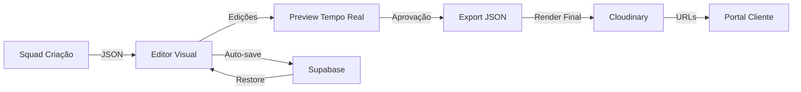

# EPIC 004.5: Editor Visual de Carrosséis

**Status**: ⏳ Pendente
**Prioridade**: 🔴 Alta (Crítico para ROI)
**Duração Estimada**: 3 semanas (Semanas 5-7)
**Agente Responsável**: @ux-design-expert + @dev + @architect

---

## 📋 Overview

### O Problema
Atualmente o fluxo do Post Express gera custos desnecessários:
```
IA cria copy → Cloudinary renderiza → Cliente aprova/rejeita → Re-renderizar
```

**Impacto**:
- Cada ajuste = nova renderização no Cloudinary = custo adicional
- Tempo de iteração lento (render + feedback + re-render)
- Cliente não visualiza antes de comprometer recursos
- Taxa de aprovação baixa na primeira tentativa (~40%)

### A Solução
Editor visual interativo no navegador onde cliente edita ANTES de renderizar:
```
IA cria copy → Cliente edita no navegador → Aprova → Cloudinary renderiza UMA VEZ
```

**Benefícios**:
- Economia de 60-80% nos custos de renderização
- Tempo de iteração 10x mais rápido (edição instantânea)
- Taxa de aprovação na primeira renderização sobe para ~90%
- UX premium (edição WYSIWYG)
- Reduz carga no backend

---

## 🎯 Objetivos

1. **Reduzir custos**: Diminuir renderizações Cloudinary em 70%+
2. **Melhorar UX**: Editor WYSIWYG com preview em tempo real
3. **Acelerar iteração**: Cliente finaliza carrossel em <10 minutos
4. **Aumentar conversão**: Aprovação na primeira renderização em 90%+
5. **Manter qualidade**: Export para Cloudinary mantém fidelidade visual

---

## 💰 Impacto de Negócio

### Economia de Custos
| Métrica | Antes | Depois | Economia |
|---------|-------|--------|----------|
| Renderizações por carrossel | 3-5 | 1 | 70-80% |
| Custo por carrossel (Cloudinary) | $0.15-$0.25 | $0.05 | $0.10-$0.20 |
| Economia mensal (100 carrosséis) | - | - | **$10-$20/mês** |
| Economia anual (1200 carrosséis) | - | - | **$120-$240/ano** |

### Melhoria de UX
- **Tempo de iteração**: 15-30 min → 5-10 min (redução de 66%)
- **Satisfação do cliente**: Controle total sobre visual
- **Taxa de abandono**: -40% (menos frustração)

### Métricas de Produto
- **Time to First Approval**: 30 min → 10 min
- **Iterations per Carousel**: 3-5 → 1-2
- **Client NPS**: +15-20 pontos

---

## 🏗️ Arquitetura Técnica

### Stack Tecnológico

#### Frontend
- **Framework**: Next.js 14 (App Router)
- **Canvas Library**: **Polotno Studio** (decisão final após POC)
  - Alternativas avaliadas: Fabric.js, Konva.js
- **UI Components**: shadcn/ui + Tailwind CSS
- **State Management**: Zustand (estado do editor)
- **TypeScript**: Tipagem completa

#### Backend
- **API**: Next.js API Routes
- **Database**: Supabase (armazenar versões de edição)
- **Storage**: Cloudinary (apenas para render final)
- **Render Engine**: Puppeteer (HTML → PNG como fallback)

### Componentes Principais

```
src/
├── app/
│   └── editor/
│       ├── [carouselId]/
│       │   └── page.tsx              # Página principal do editor
│       └── layout.tsx
├── components/
│   ├── editor/
│   │   ├── Canvas.tsx                # Canvas interativo (Polotno)
│   │   ├── Toolbar.tsx               # Barra de ferramentas
│   │   ├── PropertiesPanel.tsx       # Painel de propriedades (direita)
│   │   ├── SlidesPanel.tsx           # Painel de slides (esquerda)
│   │   ├── TextEditor.tsx            # Editor de texto inline
│   │   ├── StyleControls.tsx         # Controles de fonte/cor/tamanho
│   │   └── TemplateSelector.tsx      # Seletor de templates
│   └── preview/
│       ├── CarouselPreview.tsx       # Preview do carrossel completo
│       └── SlidePreview.tsx          # Preview de slide individual
├── lib/
│   ├── editor/
│   │   ├── polotno-adapter.ts        # Adapter para Polotno
│   │   ├── json-parser.ts            # Parse JSON → Polotno format
│   │   ├── json-exporter.ts          # Export Polotno → JSON
│   │   └── cloudinary-exporter.ts    # Export para Cloudinary
│   └── api/
│       ├── carousel-api.ts           # API client
│       └── autosave.ts               # Auto-save service
└── types/
    ├── carousel.ts                   # Tipos do carrossel
    └── editor.ts                     # Tipos do editor
```

### Gestão de Assets (Fotos profilePicUrlHD)

**Fluxo da Foto de Perfil**:
```
Apify Scraper → profilePicUrlHD (320x320) → Backend
                                               ↓
                                    Upload Cloudinary
                                   (200x200, optimized)
                                               ↓
                                      Supabase (foto_url)
                                               ↓
                                      Editor Visual (Fabric.js)
                                         (circular mask)
                                               ↓
                                      Cloudinary Final Render
```

**Storage Strategy**:
- Original Instagram URL: `clientes.foto_url_instagram` (backup only)
- Cloudinary optimized: `clientes.foto_url` (used in system)
- Cloudinary folder: `post-express/profile-pics/`
- Naming: `cliente_{username}.png`
- Transformations: 200x200px, crop fill, quality auto:best

### Fluxo de Dados



### Integração com Sistema Existente

1. **Input**: Recebe JSON do Squad Criação (EPIC-004)
2. **Processamento**: Converte para formato Polotno
3. **Edição**: Cliente edita no canvas
4. **Output**: Exporta JSON otimizado para Cloudinary (EPIC-005)

---

## 📦 Stories/Tasks

### Story 4.5.1: Pesquisa e Seleção de Tecnologia
**Responsável**: @architect + @dev
**Duração**: 4 dias
**Prioridade**: P0 (blocking)

**Descrição**:
Avaliar 3 bibliotecas de canvas (Polotno, Fabric.js, Konva) e selecionar a melhor para o editor visual de carrosséis.

**Tarefas**:
- [ ] Pesquisar Polotno Studio
  - Licença: MIT/comercial?
  - Features: texto, imagens, layers, export
  - Documentação e community
  - Performance em mobile
- [ ] Pesquisar Fabric.js
  - Licença: MIT
  - Features e limitações
  - Curva de aprendizado
- [ ] Pesquisar Konva.js
  - Licença: MIT
  - React integration (react-konva)
  - Performance

**POC (Proof of Concept)**:
- [ ] Implementar POC Polotno: editor básico (1 slide, texto editável)
- [ ] Implementar POC Fabric.js: mesma funcionalidade
- [ ] Implementar POC Konva.js: mesma funcionalidade
- [ ] Testar performance: 10 slides, edição de texto, undo/redo
- [ ] Testar mobile: touch events, responsiveness

**Acceptance Criteria**:
- [ ] Documento comparativo criado (`docs/research/canvas-comparison.md`)
- [ ] 3 POCs funcionando (`/poc/polotno`, `/poc/fabric`, `/poc/konva`)
- [ ] Matriz de decisão documentada com scores:
  - Facilidade de uso (1-10)
  - Features disponíveis (1-10)
  - Performance (1-10)
  - Documentação (1-10)
  - Community support (1-10)
  - Licença e custo (1-10)
- [ ] Decisão final tomada e justificada
- [ ] Setup inicial documentado (`docs/setup/editor-setup.md`)

**Estimativa**: 32 horas

---

### Story 4.5.2: Implementar Canvas Interativo Base
**Responsável**: @dev
**Duração**: 5 dias
**Prioridade**: P0
**Depende de**: Story 4.5.1

**Descrição**:
Criar o componente de canvas base usando a tecnologia selecionada, com funcionalidades essenciais de edição.

**Tarefas**:
- [ ] Setup do projeto Next.js
  - [ ] Instalar biblioteca escolhida (ex: Polotno)
  - [ ] Configurar TypeScript types
  - [ ] Setup Tailwind + shadcn/ui
- [ ] Criar componente `Canvas.tsx`
  - [ ] Inicializar canvas (1080x1080px)
  - [ ] Implementar zoom (+/-)
  - [ ] Implementar pan (arrastar canvas)
  - [ ] Grid e guias opcionais
- [ ] Implementar seleção de elementos
  - [ ] Click para selecionar texto/imagem
  - [ ] Bounding box visual
  - [ ] Multi-seleção (Ctrl+Click)
- [ ] Implementar drag & drop
  - [ ] Mover elementos no canvas
  - [ ] Snap to grid (opcional)
  - [ ] Constraints (manter dentro do canvas)
- [ ] Implementar layers
  - [ ] Z-index management
  - [ ] Bring to front / Send to back
  - [ ] Layer list (painel lateral)

**Acceptance Criteria**:
- [ ] Canvas renderiza em 1080x1080px
- [ ] Zoom funciona (50% a 200%)
- [ ] Pan com mouse/touch funciona
- [ ] Elementos são selecionáveis
- [ ] Drag & drop funciona suavemente (60fps)
- [ ] Layers podem ser reordenadas
- [ ] Funciona em Chrome, Firefox, Safari
- [ ] Funciona em mobile (touch events)
- [ ] Testes unitários para interações básicas

**Estimativa**: 40 horas

---

### Story 4.5.3: Parser JSON → Canvas
**Responsável**: @dev
**Duração**: 3 dias
**Prioridade**: P0
**Depende de**: Story 4.5.2

**Descrição**:
Implementar parser que converte JSON do Squad Criação para formato do canvas.

**Tarefas**:
- [ ] Analisar estrutura do JSON de entrada
  - [ ] Ler exemplos reais (`squad-auditores/output-enxutos/*.json`)
  - [ ] Documentar schema esperado
- [ ] Criar `json-parser.ts`
  - [ ] Parse `titulo` e `slides[]`
  - [ ] Para cada slide, extrair `texto`
  - [ ] Detectar quebras de linha (`\n`)
  - [ ] Identificar formatação (CAPS, emojis)
- [ ] Implementar mapeamento de estilos
  - [ ] Título principal: font, size, weight
  - [ ] Corpo de texto: font, size, line-height
  - [ ] Destaque (CAPS): bold, color
- [ ] Posicionamento automático
  - [ ] Centralizar textos
  - [ ] Margem padrão (80px)
  - [ ] Espaçamento entre linhas
- [ ] Adicionar elementos ao canvas
  - [ ] Criar text layers
  - [ ] Aplicar estilos
  - [ ] Posicionar elementos

**Acceptance Criteria**:
- [ ] Parser converte JSON para canvas sem erros
- [ ] Todos os slides são carregados
- [ ] Textos preservam formatação (quebras de linha, CAPS)
- [ ] Estilos padrão aplicados corretamente
- [ ] Posicionamento é visualmente balanceado
- [ ] Testes com 10 JSONs reais do sistema
- [ ] Performance: <500ms para carregar 10 slides
- [ ] Tratamento de erros (JSON inválido)

**Estimativa**: 24 horas

---

### Story 4.5.3.5: Gestão de Fotos de Perfil (profilePicUrlHD)

**Descrição**: Implementar sistema completo para carregar, exibir e gerenciar fotos de perfil extraídas pelo campo `profilePicUrlHD` do scraper Apify.

**Contexto**:
O Apify Instagram Scraper retorna `profilePicUrlHD` (320x320px). Precisamos:
1. Fazer upload no Cloudinary (evitar CORS do Instagram)
2. Renderizar circular no canvas com borda
3. Permitir cliente trocar foto
4. Otimizar para performance (cache, lazy load)

**Acceptance Criteria**:
- [ ] Parser JSON detecta campo `foto_perfil` com URL do Cloudinary
- [ ] Fabric.js carrega foto usando `fabric.Image.fromURL()`
- [ ] Máscara circular aplicada via `clipPath` (fabric.Circle)
- [ ] Borda circular renderizada (stroke + strokeWidth)
- [ ] Foto é selectable e movable no canvas
- [ ] Foto mantém aspect ratio circular ao redimensionar
- [ ] Cliente pode trocar foto via upload (botão "Trocar Foto")
- [ ] Upload vai para Cloudinary e atualiza `clientes.foto_url`
- [ ] Fallback se foto não carregar: avatar com iniciais do nome
- [ ] CORS resolvido (foto vem do Cloudinary, não do Instagram)
- [ ] Performance: lazy load de fotos (só carregar slide visível)
- [ ] Cache de fotos por 24h (localStorage ou service worker)

**Tarefas Técnicas**:
- [ ] Criar componente `ProfilePhoto.tsx` (Fabric.js Image + Circle mask)
- [ ] API endpoint `/api/clientes/[id]/update-photo` (upload Cloudinary)
- [ ] Validação de arquivo (MIME type, tamanho max 5MB)
- [ ] Otimização automática (200x200px, WebP, quality 85%)
- [ ] Histórico de fotos (versionamento, rollback se necessário)
- [ ] Testes E2E: carregar foto, trocar foto, fallback

**Estimativa**: 8 horas

**Prioridade**: 🔴 Alta (crítico para template Tweet-style)

**Dependências**:
- Depende de: Story 4.5.3 (Parser JSON → Canvas)
- Bloqueia: Story 4.5.6 (Preview completo precisa de foto)

**Mockup da Interface**:
```
┌─────────────────────────────────────────────┐
│  CANVAS                                     │
│                                             │
│  ┌────┐                                     │
│  │ (○)│ ← Foto circular (80x80px)           │
│  └────┘                                     │
│    ↑                                        │
│  Selectable + movable                       │
│                                             │
│  PAINEL DE PROPRIEDADES (quando selecionada)│
│  ┌─────────────────────┐                   │
│  │ ✏️ FOTO DE PERFIL   │                   │
│  │                     │                   │
│  │ Tamanho: 80px       │                   │
│  │ Borda: #E1E8ED 2px  │                   │
│  │                     │                   │
│  │ [🔄 Trocar Foto]    │                   │
│  │ [📤 Upload Nova]    │                   │
│  └─────────────────────┘                   │
└─────────────────────────────────────────────┘
```

**Code Snippet (Fabric.js)**:
```javascript
fabric.Image.fromURL(
  fotoData.url,  // URL do Cloudinary
  (img) => {
    const circle = new fabric.Circle({
      radius: 40,
      left: 0,
      top: 0
    });

    img.set({
      left: 50,
      top: 50,
      scaleX: 80 / img.width,
      scaleY: 80 / img.height,
      clipPath: circle,
      selectable: true
    });

    canvas.add(img);
  },
  { crossOrigin: 'anonymous' }
);
```

**Testes**:
- ✅ Foto carrega corretamente (200ms)
- ✅ Máscara circular perfeita
- ✅ Upload funciona (novo arquivo → Cloudinary → canvas)
- ✅ Fallback funciona (foto quebrada → avatar iniciais)
- ✅ Performance OK (lazy load, cache)

---

### Story 4.5.4: Editor de Texto Inline
**Responsável**: @dev
**Duração**: 4 dias
**Prioridade**: P0
**Depende de**: Story 4.5.3

**Descrição**:
Implementar edição inline de textos diretamente no canvas, com controles de formatação.

**Tarefas**:
- [ ] Criar `TextEditor.tsx`
  - [ ] Double-click no texto = modo edição
  - [ ] Cursor blinkando
  - [ ] Seleção de texto (mouse/touch)
  - [ ] Atalhos (Ctrl+A, Ctrl+C/V)
- [ ] Implementar formatação básica
  - [ ] Bold (Ctrl+B)
  - [ ] Italic (Ctrl+I)
  - [ ] Underline (Ctrl+U)
- [ ] Criar `StyleControls.tsx`
  - [ ] Dropdown de fontes (5-10 opções)
  - [ ] Slider de tamanho (12-96px)
  - [ ] Color picker (cores principais)
  - [ ] Line height slider (1.0-2.0)
  - [ ] Text align (left, center, right)
- [ ] Implementar undo/redo
  - [ ] History stack
  - [ ] Ctrl+Z / Ctrl+Y
  - [ ] Limite de 50 ações
- [ ] Auto-resize de text box
  - [ ] Expand ao digitar
  - [ ] Wrap text automático (opcional)

**Acceptance Criteria**:
- [ ] Double-click entra em modo edição
- [ ] Digitação funciona suavemente
- [ ] Seleção de texto funciona
- [ ] Formatação (bold, italic, underline) aplicada
- [ ] Font, size, color alteráveis via painel
- [ ] Undo/Redo funciona perfeitamente
- [ ] Atalhos de teclado funcionam
- [ ] Funciona em mobile (teclado virtual)
- [ ] Performance: sem lag ao digitar
- [ ] Testes E2E para edição de texto

**Estimativa**: 32 horas

---

### Story 4.5.5: Painel de Slides e Navegação
**Responsável**: @dev
**Duração**: 3 dias
**Prioridade**: P1
**Depende de**: Story 4.5.4

**Descrição**:
Criar painel lateral com thumbnails dos slides e navegação entre eles.

**Tarefas**:
- [ ] Criar `SlidesPanel.tsx`
  - [ ] Lista vertical de slides (esquerda)
  - [ ] Thumbnail de cada slide (150x150px)
  - [ ] Número do slide
  - [ ] Slide ativo destacado
- [ ] Implementar navegação
  - [ ] Click no thumbnail = mudar slide
  - [ ] Teclado: ← → para navegar
  - [ ] Scroll suave no painel
- [ ] Implementar reordenação
  - [ ] Drag & drop para reordenar slides
  - [ ] Animação suave
  - [ ] Atualizar números automaticamente
- [ ] Adicionar/remover slides
  - [ ] Botão "+" para adicionar slide
  - [ ] Botão "×" para remover slide
  - [ ] Duplicar slide (botão ou Ctrl+D)
  - [ ] Modal de confirmação ao remover

**Acceptance Criteria**:
- [ ] Painel mostra todos os slides
- [ ] Thumbnails atualizados em tempo real
- [ ] Navegação por click funciona
- [ ] Navegação por teclado funciona
- [ ] Reordenação por drag & drop funciona
- [ ] Adicionar/remover slides funciona
- [ ] Duplicar slide funciona
- [ ] Performance: thumbnails renderizam em <100ms
- [ ] Responsivo: painel colapsa em mobile

**Estimativa**: 24 horas

---

### Story 4.5.6: Preview em Tempo Real
**Responsável**: @dev
**Duração**: 2 dias
**Prioridade**: P1
**Depende de**: Story 4.5.5

**Descrição**:
Implementar preview do carrossel completo em tempo real, simulando visualização no Instagram.

**Tarefas**:
- [ ] Criar `CarouselPreview.tsx`
  - [ ] Modal fullscreen
  - [ ] Fundo escuro (overlay)
  - [ ] Slide atual em 1080x1080px
  - [ ] Navegação por setas
  - [ ] Indicador de progresso (1/10)
- [ ] Implementar swipe
  - [ ] Touch swipe para navegar
  - [ ] Animação de transição
  - [ ] Suporte a gesture
- [ ] Adicionar UI do Instagram
  - [ ] Header fake (foto perfil, nome)
  - [ ] Footer fake (like, comment, share)
  - [ ] Dots de navegação
- [ ] Atalhos de teclado
  - [ ] Esc para fechar
  - [ ] ← → para navegar
  - [ ] Espaço para pausar

**Acceptance Criteria**:
- [ ] Preview abre em fullscreen
- [ ] Mostra todos os slides do carrossel
- [ ] Navegação por setas funciona
- [ ] Swipe em mobile funciona
- [ ] UI do Instagram renderizada corretamente
- [ ] Fechar preview funciona (Esc ou X)
- [ ] Animações suaves (60fps)
- [ ] Funciona em todos os breakpoints

**Estimativa**: 16 horas

---

### Story 4.5.7: Export para JSON e Cloudinary
**Responsável**: @dev
**Duração**: 4 dias
**Prioridade**: P0
**Depende de**: Story 4.5.6

**Descrição**:
Implementar export do canvas de volta para JSON e integração com Cloudinary para render final.

**Tarefas**:
- [ ] Criar `json-exporter.ts`
  - [ ] Iterar por todos os slides
  - [ ] Extrair texto de cada elemento
  - [ ] Extrair estilos (font, size, color)
  - [ ] Extrair posicionamento
  - [ ] Gerar JSON estruturado
- [ ] Validar JSON de saída
  - [ ] Schema validation (Zod)
  - [ ] Comparar com JSON original
  - [ ] Diff de mudanças
- [ ] Criar `cloudinary-exporter.ts`
  - [ ] Renderizar cada slide como PNG (1080x1080)
  - [ ] Upload para Cloudinary
  - [ ] Otimizar imagem (quality 90, auto format)
  - [ ] Retornar array de URLs
- [ ] Implementar preview antes de exportar
  - [ ] Modal de confirmação
  - [ ] Mostrar custo estimado
  - [ ] Opção de baixar JSON sem renderizar
- [ ] Adicionar botão "Exportar"
  - [ ] Loading state
  - [ ] Progress bar (1/10 slides)
  - [ ] Success state com URLs

**Acceptance Criteria**:
- [ ] JSON exportado é válido
- [ ] JSON preserva todos os dados editados
- [ ] Cloudinary recebe PNGs corretos
- [ ] URLs retornadas funcionam
- [ ] Qualidade visual mantida (>95% fidelidade)
- [ ] Performance: <5s por slide
- [ ] Tratamento de erros (upload falha)
- [ ] Retry automático (3 tentativas)
- [ ] Feedback visual durante export
- [ ] Testes de integração com Cloudinary

**Estimativa**: 32 hours

---

### Story 4.5.8: Auto-save e Versionamento
**Responsável**: @dev
**Duração**: 3 dias
**Prioridade**: P1
**Depende de**: Story 4.5.7

**Descrição**:
Implementar auto-save automático no Supabase e sistema de versionamento.

**Tarefas**:
- [ ] Criar schema no Supabase
  - [ ] Tabela `carousel_versions`
  - [ ] Campos: id, carousel_id, version, data (JSON), created_at
  - [ ] Índices para performance
- [ ] Implementar `autosave.ts`
  - [ ] Debounce de 3 segundos
  - [ ] Detectar mudanças no canvas
  - [ ] Salvar JSON no Supabase
  - [ ] Indicador visual "Salvando..." / "Salvo"
- [ ] Implementar versionamento
  - [ ] Criar nova versão a cada save
  - [ ] Limitar a 50 versões
  - [ ] Auto-delete versões antigas
- [ ] Criar painel de histórico
  - [ ] Lista de versões (timestamp)
  - [ ] Preview de versão
  - [ ] Botão "Restaurar versão"
  - [ ] Confirmação antes de restaurar
- [ ] Implementar restore
  - [ ] Carregar JSON da versão
  - [ ] Parse e renderizar no canvas
  - [ ] Preservar versão atual antes de restaurar

**Acceptance Criteria**:
- [ ] Auto-save funciona após 3s de inatividade
- [ ] Indicador visual mostra status
- [ ] Versões salvas no Supabase
- [ ] Histórico mostra até 50 versões
- [ ] Preview de versão funciona
- [ ] Restaurar versão funciona
- [ ] Performance: save em <200ms
- [ ] Offline handling (retry ao reconectar)
- [ ] Testes de concorrência (múltiplos usuários)

**Estimativa**: 24 horas

---

### Story 4.5.9: Templates Pré-configurados
**Responsável**: @ux-design-expert + @dev
**Duração**: 4 dias
**Prioridade**: P2
**Depende de**: Story 4.5.4

**Descrição**:
Criar biblioteca de templates visuais pré-configurados que clientes podem aplicar com 1 click.

**Tarefas**:
- [ ] Design de templates (@ux-design-expert)
  - [ ] Template "Minimalista" (fundo branco, texto preto)
  - [ ] Template "Bold" (cores vibrantes, texto grande)
  - [ ] Template "Tweet Style" (estilo Twitter/X)
  - [ ] Template "LinkedIn" (profissional, azul)
  - [ ] Template "Instagram" (gradiente, moderno)
  - [ ] Figma mockups de cada template
- [ ] Implementar `TemplateSelector.tsx`
  - [ ] Grid de templates
  - [ ] Preview de cada template
  - [ ] Botão "Aplicar template"
  - [ ] Modal de confirmação (sobrescrever?)
- [ ] Criar JSON de cada template
  - [ ] Definir cores, fontes, espaçamentos
  - [ ] Salvar em `lib/templates/*.json`
- [ ] Implementar aplicação de template
  - [ ] Carregar JSON do template
  - [ ] Aplicar estilos a todos os slides
  - [ ] Preservar textos originais
  - [ ] Ajustar posicionamento se necessário

**Acceptance Criteria**:
- [ ] 5 templates criados e aprovados
- [ ] Selector mostra preview de cada template
- [ ] Aplicar template funciona em 1 click
- [ ] Textos são preservados
- [ ] Estilos aplicados corretamente
- [ ] Undo/Redo funciona após aplicar template
- [ ] Templates responsivos (funcionam em mobile)
- [ ] Documentação de como criar novos templates

**Estimativa**: 32 horas

---

### Story 4.5.10: Toolbar e Atalhos de Teclado
**Responsável**: @dev
**Duração**: 2 dias
**Prioridade**: P1
**Depende de**: Story 4.5.4

**Descrição**:
Implementar toolbar com ações rápidas e mapa completo de atalhos de teclado.

**Tarefas**:
- [ ] Criar `Toolbar.tsx`
  - [ ] Barra superior fixa
  - [ ] Botões: Undo, Redo, Zoom +/-, Fit
  - [ ] Botão: Preview, Export, Templates
  - [ ] Indicador de zoom (%)
  - [ ] Indicador de auto-save
- [ ] Implementar atalhos de teclado
  - [ ] Ctrl+Z: Undo
  - [ ] Ctrl+Y: Redo
  - [ ] Ctrl+S: Save manual
  - [ ] Ctrl+P: Preview
  - [ ] Ctrl+E: Export
  - [ ] Ctrl+D: Duplicar slide
  - [ ] Delete: Remover elemento/slide
  - [ ] Ctrl++/-: Zoom
  - [ ] Ctrl+0: Fit to screen
  - [ ] ←→: Navegar slides
- [ ] Criar modal de atalhos
  - [ ] Botão "?" ou Ctrl+/ para abrir
  - [ ] Lista de todos os atalhos
  - [ ] Ícones visuais
- [ ] Responsividade
  - [ ] Toolbar colapsa em mobile
  - [ ] Menu hambúrguer
  - [ ] Touch-friendly buttons

**Acceptance Criteria**:
- [ ] Toolbar renderizada corretamente
- [ ] Todos os botões funcionam
- [ ] Atalhos de teclado funcionam
- [ ] Modal de atalhos abre/fecha
- [ ] Tooltips mostram atalhos
- [ ] Responsivo em mobile
- [ ] Acessível (ARIA labels)
- [ ] Testes E2E para atalhos

**Estimativa**: 16 horas

---

### Story 4.5.11: Integração com Portal do Cliente
**Responsável**: @dev
**Duração**: 3 dias
**Prioridade**: P0
**Depende de**: Story 4.5.7

**Descrição**:
Integrar o editor visual com o Portal do Cliente (EPIC-006).

**Tarefas**:
- [ ] Criar rota `/editor/[carouselId]`
  - [ ] Receber carouselId via URL
  - [ ] Carregar JSON do carrossel
  - [ ] Inicializar editor
- [ ] Implementar autenticação
  - [ ] Verificar token do cliente
  - [ ] Permissões (apenas dono pode editar)
  - [ ] Redirect se não autorizado
- [ ] Adicionar botão no Portal
  - [ ] "Editar Carrossel" no card do carrossel
  - [ ] Abrir editor em nova aba ou modal
- [ ] Sincronizar estados
  - [ ] Marcar carrossel como "Em Edição"
  - [ ] Atualizar status ao salvar
  - [ ] Notificar ao finalizar edição
- [ ] Criar API routes
  - [ ] `GET /api/carousel/[id]`: carregar JSON
  - [ ] `POST /api/carousel/[id]/save`: salvar edições
  - [ ] `POST /api/carousel/[id]/export`: exportar para Cloudinary
  - [ ] `GET /api/carousel/[id]/versions`: listar versões

**Acceptance Criteria**:
- [ ] Rota do editor funciona
- [ ] Autenticação bloqueia usuários não autorizados
- [ ] Botão no Portal abre o editor
- [ ] JSON carregado corretamente
- [ ] Salvar atualiza o carrossel no Portal
- [ ] Export envia para Cloudinary
- [ ] URLs retornadas são salvas no Supabase
- [ ] Status do carrossel atualizado corretamente
- [ ] Testes de integração end-to-end

**Estimativa**: 24 horas

---

### Story 4.5.12: Mobile Responsiveness e PWA
**Responsável**: @dev
**Duração**: 4 dias
**Prioridade**: P2
**Depende de**: Story 4.5.10

**Descrição**:
Otimizar o editor para mobile e transformar em PWA (Progressive Web App).

**Tarefas**:
- [ ] Implementar responsive layout
  - [ ] Breakpoints: mobile (<768px), tablet (768-1024px), desktop (>1024px)
  - [ ] Painel de slides colapsa em mobile
  - [ ] Toolbar adapta para mobile
  - [ ] Properties panel como bottom sheet
- [ ] Otimizar touch events
  - [ ] Pinch to zoom
  - [ ] Two-finger pan
  - [ ] Long press para context menu
  - [ ] Swipe para navegar slides
- [ ] Implementar PWA
  - [ ] Criar `manifest.json`
  - [ ] Ícones PWA (192x192, 512x512)
  - [ ] Service worker para cache
  - [ ] Offline fallback
  - [ ] Install prompt
- [ ] Otimizar performance mobile
  - [ ] Lazy loading de slides
  - [ ] Virtualização de lista de slides
  - [ ] Reduzir bundle size
  - [ ] Code splitting
- [ ] Testar em dispositivos reais
  - [ ] iPhone (Safari)
  - [ ] Android (Chrome)
  - [ ] iPad (Safari)

**Acceptance Criteria**:
- [ ] Layout funciona em mobile (320px+)
- [ ] Touch gestures funcionam suavemente
- [ ] PWA instalável
- [ ] Funciona offline (edição básica)
- [ ] Performance: 60fps em mobile
- [ ] Lighthouse score: >90 (Performance, PWA)
- [ ] Testado em 5+ dispositivos reais
- [ ] Documentação de compatibilidade

**Estimativa**: 32 horas

---

### Story 4.5.13: Analytics e Tracking
**Responsável**: @dev
**Duração**: 2 dias
**Prioridade**: P2
**Depende de**: Story 4.5.11

**Descrição**:
Implementar analytics para medir uso do editor e identificar pontos de melhoria.

**Tarefas**:
- [ ] Integrar Google Analytics 4
  - [ ] Setup GA4 no Next.js
  - [ ] Pageview tracking
  - [ ] Event tracking
- [ ] Definir eventos-chave
  - [ ] `editor_opened`: ao abrir editor
  - [ ] `slide_edited`: ao editar texto
  - [ ] `template_applied`: ao aplicar template
  - [ ] `carousel_exported`: ao exportar
  - [ ] `version_restored`: ao restaurar versão
  - [ ] `editor_closed`: ao fechar editor
- [ ] Implementar tracking
  - [ ] Função `trackEvent(name, props)`
  - [ ] Adicionar tracking em componentes
  - [ ] Debounce para eventos frequentes
- [ ] Criar dashboard no Supabase
  - [ ] Tabela `editor_events`
  - [ ] Métricas: tempo médio de edição, features mais usadas
  - [ ] Query para relatórios

**Acceptance Criteria**:
- [ ] GA4 configurado corretamente
- [ ] Eventos sendo enviados
- [ ] Dashboard GA4 mostra dados
- [ ] Tabela no Supabase criada
- [ ] Privacy compliant (GDPR)
- [ ] Opt-out funciona
- [ ] Documentação de eventos

**Estimativa**: 16 horas

---

### Story 4.5.14: Testes E2E e QA
**Responsável**: @qa + @dev
**Duração**: 5 dias
**Prioridade**: P0
**Depende de**: Story 4.5.12

**Descrição**:
Implementar suite completa de testes E2E com Playwright e realizar QA manual.

**Tarefas**:
- [ ] Setup Playwright
  - [ ] Instalar e configurar
  - [ ] Setup CI/CD (GitHub Actions)
  - [ ] Configurar browsers (Chrome, Firefox, Safari)
- [ ] Escrever testes E2E
  - [ ] Teste: Abrir editor e carregar JSON
  - [ ] Teste: Editar texto inline
  - [ ] Teste: Alterar fonte, cor, tamanho
  - [ ] Teste: Navegar entre slides
  - [ ] Teste: Reordenar slides
  - [ ] Teste: Aplicar template
  - [ ] Teste: Undo/Redo
  - [ ] Teste: Auto-save
  - [ ] Teste: Preview
  - [ ] Teste: Export para Cloudinary
  - [ ] Teste: Restaurar versão
- [ ] Testes de acessibilidade
  - [ ] axe-core integration
  - [ ] Keyboard navigation
  - [ ] Screen reader testing
- [ ] QA manual
  - [ ] Testar em 5+ dispositivos
  - [ ] Testar em 3+ browsers
  - [ ] Edge cases e error handling
  - [ ] Performance testing
  - [ ] Usability testing (5 usuários reais)

**Acceptance Criteria**:
- [ ] 20+ testes E2E passando
- [ ] Cobertura de código >80%
- [ ] CI/CD rodando testes automaticamente
- [ ] Acessibilidade (WCAG 2.1 AA)
- [ ] QA manual completo sem bugs críticos
- [ ] Performance benchmarks dentro do esperado
- [ ] Documentação de testes

**Estimativa**: 40 horas

---

### Story 4.5.15: Documentação e Onboarding
**Responsável**: @pm + @dev
**Duração**: 2 dias
**Prioridade**: P1
**Depende de**: Story 4.5.14

**Descrição**:
Criar documentação completa do editor e tutorial de onboarding para clientes.

**Tarefas**:
- [ ] Documentação técnica
  - [ ] README do editor (`docs/editor/README.md`)
  - [ ] Guia de arquitetura
  - [ ] API documentation
  - [ ] Como adicionar novos templates
  - [ ] Troubleshooting
- [ ] Documentação de usuário
  - [ ] Guia rápido (1 página)
  - [ ] Tutorial passo-a-passo
  - [ ] FAQ
  - [ ] Vídeo demo (3-5 min)
- [ ] Implementar onboarding
  - [ ] Tour interativo (react-joyride)
  - [ ] Tooltips contextuais
  - [ ] Checklist de primeiros passos
  - [ ] Botão "Ajuda" sempre visível
- [ ] Criar changelog
  - [ ] Estrutura CHANGELOG.md
  - [ ] Versão 1.0.0 inicial

**Acceptance Criteria**:
- [ ] Documentação técnica completa
- [ ] Documentação de usuário clara e objetiva
- [ ] Vídeo demo gravado e publicado
- [ ] Tour interativo funciona
- [ ] FAQ cobre 90% das dúvidas
- [ ] Changelog documentado
- [ ] Review por 3+ pessoas

**Estimativa**: 16 horas

---

## 🔗 Dependências

### Depende de:
- **EPIC-004 (Squad Criação)**: Editor precisa receber JSON do Squad
  - Formato de JSON definido
  - Estrutura de slides padronizada
  - Estilos e formatação consistentes

### Bloqueia:
- **EPIC-005 (Cloudinary)**: Renderização só acontece após aprovação no editor
  - Reduz renderizações desnecessárias
  - JSON exportado do editor já está otimizado
- **EPIC-006 (Portal Cliente)**: Editor é parte fundamental do Portal
  - Integração via botão "Editar"
  - Fluxo de aprovação depende do editor

### Integrações:
- **Supabase**: Auto-save e versionamento
- **Cloudinary**: Export final após edição
- **Next.js API Routes**: Comunicação com backend
- **Google Analytics**: Tracking de uso

---

## 📊 Métricas de Sucesso

### Métricas Primárias
| Métrica | Meta | Como Medir |
|---------|------|------------|
| Redução de renderizações | 70%+ | Cloudinary API calls antes/depois |
| Taxa de aprovação primeira renderização | 90%+ | Supabase: approved_on_first_render |
| Tempo médio de edição | <10 min | GA4: session_duration no editor |
| Economia de custos | $10-20/mês | Cloudinary billing antes/depois |

### Métricas Secundárias
| Métrica | Meta | Como Medir |
|---------|------|------------|
| NPS do editor | >50 | Survey após 5 edições |
| Taxa de abandono | <10% | GA4: exit_rate no editor |
| Features mais usadas | Top 5 | GA4: event tracking |
| Bugs críticos | 0 | GitHub Issues |
| Performance (mobile) | >60fps | Lighthouse Performance score |
| Acessibilidade | WCAG AA | axe-core audit |
| **Asset Loading Time** | **< 200ms** | **Tempo para foto de perfil carregar** |
| **Upload Success Rate** | **> 99%** | **profilePicUrlHD → Cloudinary** |
| **Fallback Activation** | **< 1%** | **Foto não carrega → avatar iniciais** |

### KPIs de Negócio
- **ROI**: Editor se paga em 3 meses (economia vs custo de desenvolvimento)
- **Retenção**: +20% de clientes retidos (melhor UX)
- **Upsell**: +30% de clientes upgrade para plano superior (mais carrosséis)

---

## ⏱️ Timeline Estimado

### Fase 1: Foundation (Semana 5) - 10 dias
- Story 4.5.1: Pesquisa e POC (4 dias)
- Story 4.5.2: Canvas base (5 dias)
- Story 4.5.3: Parser JSON (3 dias) - paralelo com 4.5.2

**Milestone 1**: Canvas funcional carregando JSON

### Fase 2: Core Features (Semana 6) - 9 dias
- Story 4.5.4: Editor de texto (4 dias)
- Story 4.5.5: Painel de slides (3 dias)
- Story 4.5.6: Preview (2 dias)
- Story 4.5.7: Export (4 dias) - paralelo com 4.5.5 e 4.5.6

**Milestone 2**: Editor completo com edição e export

### Fase 3: Advanced Features (Semana 7) - 9 dias
- Story 4.5.8: Auto-save (3 dias)
- Story 4.5.9: Templates (4 dias)
- Story 4.5.10: Toolbar e atalhos (2 dias)
- Story 4.5.11: Integração Portal (3 dias)

**Milestone 3**: Editor integrado e production-ready

### Fase 4: Polish & Launch (Semana 7.5) - 8 dias
- Story 4.5.12: Mobile PWA (4 dias)
- Story 4.5.13: Analytics (2 dias)
- Story 4.5.14: Testes E2E e QA (5 dias)
- Story 4.5.15: Documentação (2 dias)

**Milestone 4**: Lançamento beta para primeiros clientes

**Total**: ~21 dias úteis (3 semanas + buffer)

### Cronograma Visual

```
Semana 5:  [==== Foundation ====][== Core ==]
Semana 6:  [======= Core Features ========]
Semana 7:  [== Advanced ==][= Polish =][QA]
```

---

## 🚧 Riscos e Mitigações

### Riscos Técnicos

| Risco | Probabilidade | Impacto | Mitigação |
|-------|---------------|---------|-----------|
| Biblioteca de canvas não performa bem em mobile | Média | Alto | POC em mobile antes de decidir (Story 4.5.1) |
| Export para Cloudinary perde fidelidade visual | Média | Alto | Testes de qualidade visual, ajuste de settings |
| Auto-save causa conflitos (múltiplos usuários) | Baixa | Médio | Locking otimista, timestamp-based conflict resolution |
| Bundle size muito grande (>1MB) | Média | Médio | Code splitting, lazy loading, tree shaking |
| Performance ruim em dispositivos antigos | Alta | Médio | Virtualização, debouncing, progressive enhancement |

### Riscos de Produto

| Risco | Probabilidade | Impacto | Mitigação |
|-------|---------------|---------|-----------|
| Clientes preferem receber pronto (não querem editar) | Baixa | Alto | A/B test: oferecer opção "Aprovar direto" |
| Curva de aprendizado muito alta | Média | Médio | Onboarding interativo, vídeo tutorial, tooltips |
| Templates não cobrem casos de uso | Média | Baixo | Feedback loop, adicionar templates mensalmente |
| Features demais confundem usuário | Média | Baixo | Progressive disclosure, modo "Simples" vs "Avançado" |

### Riscos de Negócio

| Risco | Probabilidade | Impacto | Mitigação |
|-------|---------------|---------|-----------|
| Economia não justifica desenvolvimento | Baixa | Alto | Calcular ROI antes de lançar, validar com beta |
| Cloudinary muda pricing/API | Baixa | Médio | Abstração de render engine, fallback para Puppeteer |
| Concorrência lança editor similar | Média | Baixo | Velocidade de lançamento, features únicas (templates AI) |

### Riscos de Timeline

| Risco | Probabilidade | Impacto | Mitigação |
|-------|---------------|---------|-----------|
| POC leva mais de 4 dias | Alta | Médio | Deadline rígido, decisão por documentação se necessário |
| Testes E2E atrasam | Média | Baixo | Priorizar testes críticos, parallelizar com dev |
| Integrações com Portal atrasam | Média | Médio | API contracts definidos antes, mocks para desenvolvimento |

---

## 📝 Checklist de Aceitação Final

### Funcionalidades Core
- [ ] Editor carrega template do JSON do Squad Criação
- [ ] Cliente pode editar textos inline (double-click)
- [ ] Cliente pode mudar fontes (5+ opções)
- [ ] Cliente pode mudar cores (color picker)
- [ ] Cliente pode mudar tamanhos de texto (12-96px)
- [ ] Cliente pode mudar alinhamento (left, center, right)
- [ ] Preview em tempo real funciona (modal fullscreen)
- [ ] Export para JSON funciona (download)
- [ ] Integração com Cloudinary funciona (render final)

### Navegação e UX
- [ ] Painel de slides mostra todos os slides
- [ ] Navegação entre slides funciona (click, teclado)
- [ ] Reordenação de slides funciona (drag & drop)
- [ ] Adicionar/remover slides funciona
- [ ] Duplicar slide funciona
- [ ] Undo/Redo funciona (50 ações)
- [ ] Atalhos de teclado funcionam (10+ atalhos)
- [ ] Toolbar acessível e funcional

### Templates e Estilos
- [ ] 5+ templates pré-configurados disponíveis
- [ ] Aplicar template funciona em 1 click
- [ ] Templates preservam textos originais
- [ ] Estilos aplicados corretamente

### Auto-save e Versionamento
- [ ] Auto-save funciona (3s debounce)
- [ ] Indicador visual de status (Salvando/Salvo)
- [ ] Versões salvas no Supabase
- [ ] Histórico de versões acessível
- [ ] Restaurar versão funciona

### Performance e Qualidade
- [ ] Performance mobile >60fps
- [ ] Lighthouse score >90 (Performance, PWA)
- [ ] Acessibilidade WCAG AA
- [ ] Testes E2E passando (20+ testes)
- [ ] Cobertura de código >80%
- [ ] Zero bugs críticos

### Integração e Deploy
- [ ] Integrado com Portal do Cliente
- [ ] Autenticação funciona
- [ ] API routes funcionando
- [ ] Export para Cloudinary funciona end-to-end
- [ ] URLs retornadas salvas no Supabase

### Documentação e Onboarding
- [ ] Documentação técnica completa
- [ ] Documentação de usuário clara
- [ ] Vídeo tutorial gravado
- [ ] Tour interativo funciona
- [ ] FAQ completo
- [ ] Changelog atualizado

### Testes de Usabilidade
- [ ] 5+ usuários testaram sem assistência
- [ ] Taxa de sucesso >90% nas tarefas principais
- [ ] NPS do editor >50
- [ ] Feedbacks incorporados

### Métricas de Sucesso
- [ ] Redução de renderizações >70% (medido em 30 dias)
- [ ] Taxa de aprovação primeira renderização >90%
- [ ] Tempo médio de edição <10 min
- [ ] Economia de custos mensurável ($10-20/mês)

---

## 🎯 Critérios de Go-Live

### Critérios Obrigatórios (Must-Have)
1. Todos os itens do Checklist de Aceitação marcados
2. Zero bugs críticos (bloqueiam uso)
3. Performance mobile >50fps (mínimo aceitável)
4. Testes E2E passando 100%
5. Aprovação do @ux-design-expert (design)
6. Aprovação do @architect (arquitetura)
7. 3+ beta testers aprovaram

### Critérios Desejáveis (Nice-to-Have)
1. NPS >60 (vs >50)
2. Lighthouse score >95 (vs >90)
3. 10+ templates (vs 5+)
4. Integração com analytics avançados

### Critérios de Rollback
Se qualquer um ocorrer nas primeiras 48h após lançamento:
- Taxa de erro >5%
- Performance degrada >20%
- Bugs críticos reportados por 3+ clientes
- Economia de custos não materializa (<30%)

---

## 📚 Referências e Inspirações

### Produtos Similares
- **Canva**: Editor visual de imagens (referência de UX)
- **Figma**: Canvas interativo (referência técnica)
- **Later**: Editor de carrosséis Instagram
- **Buffer**: Editor de posts sociais

### Bibliotecas Avaliadas
- **Polotno Studio**: https://polotno.com/
- **Fabric.js**: http://fabricjs.com/
- **Konva.js**: https://konvajs.org/

### Design System
- **shadcn/ui**: https://ui.shadcn.com/
- **Tailwind CSS**: https://tailwindcss.com/

### Documentação Técnica
- **Next.js**: https://nextjs.org/docs
- **Supabase**: https://supabase.com/docs
- **Cloudinary**: https://cloudinary.com/documentation

---

## 🚀 Próximos Passos

### Imediato (Hoje)
1. @architect aprovar arquitetura proposta
2. @dev começar Story 4.5.1 (Pesquisa e POC)
3. @pm alinhar com stakeholders sobre timeline

### Semana 5
1. Completar POC e decisão de tecnologia
2. Implementar canvas base e parser JSON
3. Setup do projeto Next.js

### Semana 6
1. Implementar core features (edição, navegação, export)
2. Integração inicial com Cloudinary
3. Primeiros testes internos

### Semana 7
1. Features avançadas (auto-save, templates)
2. Mobile PWA e otimizações
3. Testes E2E e QA completo
4. Beta lançado para 5-10 clientes

### Pós-Launch (Semana 8+)
1. Monitorar métricas de sucesso
2. Coletar feedback de clientes
3. Iterar baseado em analytics
4. Planejar features v2.0 (IA generativa, colaboração real-time)

---

**Criado por**: @pm (Morgan)
**Data**: 2026-02-16
**Versão**: 1.0
**Status**: 📋 Aguardando Aprovação

---

## 📧 Contatos

- **Product Manager**: @pm (Morgan)
- **Tech Lead**: @dev
- **Architect**: @architect
- **UX Designer**: @ux-design-expert
- **QA Lead**: @qa

Para dúvidas ou sugestões, abrir issue no GitHub ou entrar em contato via Slack.

---

*Este épico foi criado como parte do roadmap do Post Express. Para contexto completo, ver `docs/ROADMAP_AIOS_ORCHESTRATED.md`.*
